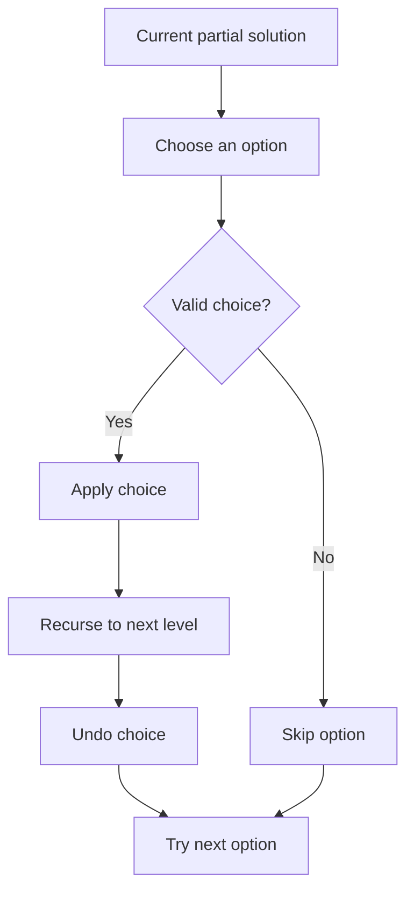

# Backtracking Pattern: A Reasoning-First C++ Guide

Backtracking explores choices recursively, rejects invalid partial solutions early, and restores the state before trying the next choice.

## Table of Contents
1. [Core Concept & Philosophy](#1-core-concept--philosophy)
2. [Backtracking = Recursion + Undo](#2-backtracking--recursion--undo)
3. [The Universal Template](#3-the-universal-template)
4. [Why This Template Works — The State-Space Tree](#4-why-this-template-works--the-state-space-tree)
5. [Mental Model & Pattern Recognition](#5-mental-model--pattern-recognition)
6. [Basic Applications](#6-basic-applications)
7. [Advanced Applications](#7-advanced-applications)
8. [Pruning: Turning Exponential into Practical](#8-pruning-turning-exponential-into-practical)
9. [Problem-Solving Framework](#9-problem-solving-framework)
10. [Common Pitfalls](#10-common-pitfalls)
11. [Practice Roadmap](#11-practice-roadmap)

---

## 1. Core Concept & Philosophy

### What Backtracking Really Is

Backtracking is recursion with a changing shared state. At each level, choose one option, explore it, then undo the change so the next option starts from the same state.

The key discipline is: **whatever you change before recursing must be restored after the recursive call returns**. Without the restoration, branches contaminate one another.

### The Generalized Form

```
Explore every choice at this step
   → make the choice (place a queen, add a number, pick a letter)
   → recurse into the next step
   → undo the choice (remove the queen, remove the number)  ← THE ONLY NEW IDEA
Try the next choice
```

### Backtracking State Diagram



The undo edge is essential: every branch must start from the same state that existed before its choice was applied.

This "undo" step is the central difference between ordinary recursion and backtracking. The base case, recursive call, and recursion tree are still the same ideas from [Recursion_Pattern.md](Recursion_Pattern.md).

---

## 2. Backtracking = Recursion + Undo

Frame every backtracking problem with **3 questions**, extending the Hypothesis → Induction → Base Case method from [Recursion_Pattern.md](Recursion_Pattern.md):

### Question 1 — What are my choices at this step?
> N-Queens: which column in this row can I place a queen in?
> Subsets: include this element or not?
> Sudoku: which digit (1-9) can go in this empty cell?

### Question 2 — Is this choice valid? (the constraint / pruning check)
> Is this column/diagonal already attacked? Does this digit already exist in the row/col/box?
> If invalid → skip immediately, don't even recurse (this is called **pruning**, section 8).

### Question 3 — Do, Recurse, Undo
> **Do** the choice → mutate shared state (add to path, place on board).
> **Recurse** to the next step.
> **Undo** the choice → the state must look exactly as it did before you made the choice, so that the *next* choice at this level starts clean.

```
   CHOICE               VALIDITY CHECK           DO → RECURSE → UNDO
"what can I          "does it break a         "make it, explore deeper,
 try here?"           rule/constraint?"          then erase it"
      │                     │                          │
      ▼                     ▼                          ▼
for (each option)   if (!isValid(option))       path.add(option);
                         continue;               backtrack(next);
                                                  path.remove(last);  ← UNDO
```

---

## 3. The Universal Template

### C++ Implementation

```cpp
void backtrack(Params state, int step, ResultCollector& results) {
    // 1. BASE CASE — a complete, valid solution has been built
    if (isComplete(state, step)) {
        results.add(state);   // record a copy, not a reference!
        return;
    }

    // 2. TRY EVERY CHOICE AVAILABLE AT THIS STEP
    for (auto& choice : choicesAt(step)) {

        // 3. PRUNE — skip choices that violate constraints
        if (!isValid(state, choice)) continue;

        // 4. DO — make the choice
        applyChoice(state, choice);

        // 5. RECURSE — explore deeper with this choice locked in
        backtrack(state, step + 1, results);

        // 6. UNDO — remove the choice (THE CRITICAL BACKTRACKING STEP)
        undoChoice(state, choice);
    }
}
```

### Four Critical Components

**1. Choices** — What are the branches out of this node? (columns, digits, remaining letters…)

**2. Constraints (Validity/Pruning)** — What makes a choice illegal *right now*? Checking this BEFORE recursing avoids wasting time exploring dead branches (see Section 8).

**3. Goal / Base Case** — When is a path considered a complete valid answer?

**4. Undo** — Exactly reverse step 4 (`applyChoice`) so sibling branches at the same level are unaffected. If you forget this, later branches silently see corrupted state — the #1 backtracking bug (see Pitfall 1).

---

## 4. Why This Template Works — The State-Space Tree

Backtracking explores a tree of **all possible partial solutions**, called the **state-space tree**. It uses the same branching idea as Pick/Not-Pick recursion, but explicitly manages shared mutable state with Do/Undo.

### Example: Generating all permutations of `[1, 2]`

```
                    backtrack([], step=0)
                 choose 1 /        \ choose 2
        backtrack([1],1)           backtrack([2],1)
         choose 2 |                     | choose 1
        backtrack([1,2],2)        backtrack([2,1],2)
              │                          │
         BASE: complete!            BASE: complete!
         record [1,2]               record [2,1]
              │                          │
          UNDO: remove 2             UNDO: remove 1
              │                          │
        back to [1], try            back to [2], try
        next choice (none left)     next choice (none left)
              │                          │
         UNDO: remove 1             UNDO: remove 2
              │                          │
         back to [], try 2          back to [], try 1 (already done)
```

### The Do/Undo Symmetry — Why It Must Be Exact

```
BEFORE recursing:        path = [1]        board[row][col] = 'Q'
                              │                    │
                        (explore subtree)    (explore subtree)
                              │                    │
AFTER recursing:         path = []          board[row][col] = '.'
                    (undo brings state back to EXACTLY pre-choice condition)
```

If `applyChoice` and `undoChoice` aren't perfectly symmetric, sibling branches inherit corrupted state — this is the single most common backtracking bug, and it's invisible until you test with more than one branch.

---

## 5. Mental Model & Pattern Recognition

### When to Use Backtracking?

1. **Am I generating ALL valid configurations** (not just checking if one exists, and not optimizing a number)?
   - All permutations, all subsets, all valid boards → Backtracking.
    - "Minimum/maximum value" → often Dynamic Programming instead (see [DynamicProgramming_Pattern.md](DynamicProgramming_Pattern.md)).

2. **Do choices have constraints that can invalidate a whole branch early?**
   - N-Queens: a queen in row 3 might make row 4 impossible → prune immediately.

3. **Is the problem naturally a sequence of decisions?**
   - Decide digit-by-digit, row-by-row, element-by-element.

### Visual Pattern Recognition

```
Pattern 1: Subset/Combination Backtracking (Pick/Not-Pick from recursion)
    include arr[i]  OR  exclude arr[i]  →  recurse on i+1

Pattern 2: Permutation Backtracking (swap-based or used[] array)
    try EVERY unused element in this position → mark used → recurse → unmark

Pattern 3: Grid/Board Backtracking (N-Queens, Sudoku, Word Search)
    try EVERY valid cell/value at this position → place → recurse → remove

Pattern 4: Partition Backtracking (Palindrome Partitioning, Combination Sum)
    try every possible "cut point" or "next number" → recurse on the remainder
```

### A Useful Learning Order
Study recursion first, then subsets and combinations, permutations, N-Queens, Sudoku Solver, Rat in a Maze, M-Coloring, and Word Break. Each problem reuses the same template from Section 3; only `choicesAt()`, `isValid()`, and `isComplete()` change.

---

## 6. Basic Applications

### Example 1: Print All Subsets (Combination pattern)

#### Question (English)

Given an array, how can you generate every possible subset?

#### Intuition (Sochna Kaise Hai?)

#### Example Inputs

```text
nums = [1, 2, 3]
nums = [a, b]
```

Har element par do choices hain: include karo ya skip karo. Ek choice ke baad recurse karo, phir state undo karke doosri branch explore karo.

**Choices:** include or exclude `arr[idx]`.
**Base Case:** `idx == arr.size()`.
**No pruning needed** — every subset is "valid."

```cpp
void subsets(vector<int>& arr, int idx, vector<int>& path, vector<vector<int>>& res) {
    if (idx == arr.size()) {
        res.push_back(path);          // record a COPY
        return;
    }
    // Choice 1: include
    path.push_back(arr[idx]);
    subsets(arr, idx + 1, path, res);
    path.pop_back();                  // UNDO

    // Choice 2: exclude
    subsets(arr, idx + 1, path, res);
}
```

This is the same Pick/Not-Pick idea as the recursion guide. Subsets are useful as the first backtracking exercise, even though there is little constraint-based pruning.

---

### Example 2: Permutations (the first REAL backtracking pattern)

#### Question (English)

Given distinct values, how can you generate all possible orderings?

#### Intuition (Sochna Kaise Hai?)

#### Example Inputs

```text
nums = [1, 2, 3]
nums = [a, b, c]
```

Har position par koi unused value choose karo. Use mark karke aage badho, aur return par unmark karo taaki wahi value doosri position par try ho sake.

**Choices:** any unused number can go in the current position.
**Constraint:** number must not already be used in the current path.

```cpp
void permute(vector<int>& nums, vector<int>& path, vector<bool>& used, vector<vector<int>>& res) {
    if (path.size() == nums.size()) {
        res.push_back(path);
        return;
    }
    for (int i = 0; i < nums.size(); i++) {
        if (used[i]) continue;          // PRUNE: already in this path

        used[i] = true;                 // DO
        path.push_back(nums[i]);

        permute(nums, path, used, res); // RECURSE

        path.pop_back();                // UNDO
        used[i] = false;                // UNDO
    }
}
```

**Dry Run — `nums = [1,2,3]`, partial trace:**
```
path=[]        try 1 → path=[1]
path=[1]       try 2 → path=[1,2]
path=[1,2]     try 3 → path=[1,2,3] → BASE, record [1,2,3]
path=[1,2,3]   undo 3 → path=[1,2]
path=[1,2]     no more choices → undo 2 → path=[1]
path=[1]       try 3 → path=[1,3]
path=[1,3]     try 2 → path=[1,3,2] → BASE, record [1,3,2]
... continues until all 3! = 6 permutations are found
```

---

## 7. Advanced Applications

### Example 3: N-Queens

#### Question (English)

How can you place `N` queens on an `N x N` board so that no two queens attack each other?

#### Intuition (Sochna Kaise Hai?)

#### Example Inputs

```text
n = 4
n = 5
```

Ek row mein ek queen place karo aur column, main diagonal, anti-diagonal ko check karo. Invalid placement ko turant reject karna pruning hai; valid branch se return par queen hatao.

**Problem:** Place N queens on an N×N board so no two attack each other.

**Choices:** for the current row, which column can hold a queen?
**Constraint:** column not used, and no queen on either diagonal.
**Base Case:** placed a queen in every row (`row == n`).

```cpp
class Solution {
public:
    vector<vector<string>> solveNQueens(int n) {
        vector<vector<string>> res;
        vector<string> board(n, string(n, '.'));
        vector<bool> colUsed(n), diag1(2*n), diag2(2*n);   // diag1: row+col, diag2: row-col+n
        backtrack(0, n, board, colUsed, diag1, diag2, res);
        return res;
    }

private:
    void backtrack(int row, int n, vector<string>& board,
                   vector<bool>& colUsed, vector<bool>& diag1, vector<bool>& diag2,
                   vector<vector<string>>& res) {
        if (row == n) {                       // BASE CASE
            res.push_back(board);
            return;
        }
        for (int col = 0; col < n; col++) {
            int d1 = row + col, d2 = row - col + n;
            if (colUsed[col] || diag1[d1] || diag2[d2]) continue;  // PRUNE

            // DO
            board[row][col] = 'Q';
            colUsed[col] = diag1[d1] = diag2[d2] = true;

            backtrack(row + 1, n, board, colUsed, diag1, diag2, res); // RECURSE

            // UNDO
            board[row][col] = '.';
            colUsed[col] = diag1[d1] = diag2[d2] = false;
        }
    }
};
```

**State-Space Tree for N=4 (partial):**
```
row0: try col0 ──► row1: col0,1 pruned(diag/col) → try col2
                        row2: everything pruned by row0(col0)+row1(col2) → DEAD END
                        BACKTRACK to row1, try col3
                        row2: try col1 → row3: everything pruned → DEAD END
                        BACKTRACK all the way to row0
      try col1 ──► ... eventually finds valid full board
```
Notice how entire subtrees die immediately due to pruning — this is what makes N-Queens tractable despite looking like `n^n` choices.

### Example 4: Sudoku Solver (Grid Backtracking)

#### Question (English)

How can you fill a Sudoku grid so every row, column, and box contains each digit at most once?

#### Intuition (Sochna Kaise Hai?)

#### Example Inputs

```text
board = ["53..7....", "6..195...", "...6....8", "8...6...3", "4..8.3..1", "7...2...6", ".6....28.", "...419..5", "....8..79"]
board = ["..9748...", "7........", ".2.1.9...", "..7...24.", ".64.1.59.", ".98...3..", "...8.3.2.", "........6", "...2759.."]
```

Empty cell par legal digits try karo. Agar aage contradiction aaye toh last digit undo karke next digit try karo; isi systematic trial-and-undo se solution milta hai.

**Choices:** for the current empty cell, try digits `1`–`9`.
**Constraint:** digit must not repeat in the row, column, or 3×3 box.
**Base Case:** no empty cells remain.

```cpp
bool solveSudoku(vector<vector<char>>& board) {
    for (int r = 0; r < 9; r++) {
        for (int c = 0; c < 9; c++) {
            if (board[r][c] != '.') continue;

            for (char d = '1'; d <= '9'; d++) {
                if (!isValid(board, r, c, d)) continue;   // PRUNE

                board[r][c] = d;                          // DO
                if (solveSudoku(board)) return true;      // RECURSE
                board[r][c] = '.';                        // UNDO
            }
            return false;   // no digit 1-9 worked here → dead end, backtrack up
        }
    }
    return true;             // BASE CASE: filled the whole board, no empty cell left
}
```

Note the **return-value-driven backtracking**: instead of collecting all solutions, we stop at the first success (`if (solveSudoku(board)) return true`) — a very common variant when the problem asks for "does a solution exist" rather than "all solutions."

---

## 8. Pruning: Turning Exponential into Practical

Backtracking's worst case is always exponential (it explores a tree of choices), but **pruning** — cutting off invalid branches as early as possible — is what makes it fast in practice.

```
WITHOUT PRUNING (check validity only at the leaf):
  Explore ALL n^n or n! combinations, THEN filter valid ones at the end.
  → Wastes enormous time building doomed partial solutions.

WITH PRUNING (check validity at EVERY step):
  The moment a partial solution breaks a constraint, STOP exploring that branch.
  → Dead branches are cut near the root, saving exponentially more work
    the earlier the check happens.
```

**Rule of thumb:** always check `isValid()` **before** recursing deeper, never after. Checking at the leaf defeats the purpose of backtracking.

```
     Good pruning (check early)         Bad "pruning" (check late)
            root                                root
           /    \                              /    \
     valid?      invalid? ✗ STOP HERE      keep going...    keep going...
      /                                        /    \           /    \
  keep exploring                          ... only check validity
  (small subtree)                          at the very bottom (huge subtree)
```

---

## 9. Problem-Solving Framework

**Step 1: Identify the Choices**
```
□ What decision am I making at each step? (place a queen, pick a digit, add an element)
```

**Step 2: Identify the Constraints**
```
□ What makes a choice invalid right now?
□ Can I check this BEFORE recursing (pruning) instead of after?
```

**Step 3: Identify the Base Case (Goal State)**
```
□ When is a path a COMPLETE valid answer?
□ Am I collecting ALL solutions, or stopping at the FIRST valid one?
```

**Step 4: Write Do → Recurse → Undo, Symmetrically**
```cpp
applyChoice(state, choice);
backtrack(state, nextStep);
undoChoice(state, choice);   // must exactly reverse applyChoice
```

**Step 5: Add Pruning as Early as Possible**
```
□ Move validity checks to the TOP of the loop body, before any mutation.
```

### Common Patterns Checklist

| Problem Contains | Pattern | Choices | Constraint |
|---|---|---|---|
| "all subsets/combinations" | Include/Exclude | pick or skip `arr[idx]` | none, or `sum <= target` |
| "all permutations" | Used-array / swap | any unused element | not already used |
| "N-Queens / M-Coloring" | Grid placement | valid row/col/color | no conflict with existing placements |
| "Sudoku / crossword fill" | Cell-by-cell fill | digit/letter 1-9 or a-z | row/col/box/word rules |
| "word search in grid" | DFS + visited marking | 4 neighboring directions | in-bounds, unvisited, letter matches |
| "partition into valid parts" | Cut-point exploration | every possible next cut | each part must satisfy a rule (e.g. palindrome) |

---

## 10. Common Pitfalls

### Pitfall 1: Forgetting to Undo (the #1 backtracking bug)
```cpp
// WRONG
path.push_back(x);
backtrack(...);
// forgot path.pop_back()! Every subsequent sibling branch now has extra "x"
```

### Pitfall 2: Recording a Reference Instead of a Copy
```cpp
// WRONG: path is a reference; every future mutation changes ALL previously stored answers
res.push_back(path);

// RIGHT: force a copy
res.push_back(vector<int>(path));
```

### Pitfall 3: Pruning Too Late (checking validity only at the base case)
```
This technically still works but defeats the performance benefit of backtracking —
you'll build full-depth dead branches before discovering they're invalid.
```

### Pitfall 4: Asymmetric Do/Undo
```cpp
// WRONG: marks used[i]=true but undoes a DIFFERENT index due to a copy-paste bug
used[i] = true;
...
used[j] = false;   // should be used[i] = false!
```

### Pitfall 5: Confusing "Find All" vs "Find One"
```
"Find all solutions" → keep exploring after finding one, use vector<vector<>> res
"Find if any solution exists" → return true/false and STOP at first success
                                  (see Sudoku Solver's `if (solveSudoku(board)) return true;`)
```

### Pitfall 6: Not Handling Duplicates
```
Subsets/Permutations with duplicate input values need an extra check
(e.g., skip if `i > idx && nums[i] == nums[i-1]`) to avoid duplicate branches
in the state-space tree — a very common LeetCode "II" variant (Subsets II,
Permutations II, Combination Sum II).
```

---

## 11. Practice Roadmap

**Reading / Practice:**
- Recursion and Backtracking practice sheet
- GeeksforGeeks — Backtracking Algorithms: https://www.geeksforgeeks.org/backtracking-algorithms/
- LeetCode Backtracking tag: https://leetcode.com/tag/backtracking/

**Practice Problems (Ordered by Difficulty)**

*Easy/Medium (Foundation):*
- Subsets — https://leetcode.com/problems/subsets/
- Subsets II — https://leetcode.com/problems/subsets-ii/
- Permutations — https://leetcode.com/problems/permutations/
- Permutations II — https://leetcode.com/problems/permutations-ii/
- Combination Sum — https://leetcode.com/problems/combination-sum/
- Combination Sum II — https://leetcode.com/problems/combination-sum-ii/
- Letter Combinations of a Phone Number — https://leetcode.com/problems/letter-combinations-of-a-phone-number/
- Generate Parentheses — https://leetcode.com/problems/generate-parentheses/

*Hard (Grid & Constraint-heavy):*
- N-Queens — https://leetcode.com/problems/n-queens/
- N-Queens II (count only) — https://leetcode.com/problems/n-queens-ii/
- Sudoku Solver — https://leetcode.com/problems/sudoku-solver/
- Word Search — https://leetcode.com/problems/word-search/
- Palindrome Partitioning — https://leetcode.com/problems/palindrome-partitioning/
- Rat in a Maze (GFG) — https://www.geeksforgeeks.org/rat-in-a-maze-backtracking-2/
- M-Coloring Problem (GFG) — https://www.geeksforgeeks.org/m-coloring-problem/

---

## Key Takeaways

1. **Backtracking = recursion + a mandatory Undo step.** If you can write the Pick/Not-Pick recursion, you can write backtracking.
2. **Always check validity BEFORE recursing (pruning), not after** — this is what keeps exponential problems solvable in practice.
3. **Do → Recurse → Undo must be perfectly symmetric.** Every mutation before the recursive call needs an exact reversal after it.
4. **"Find all" vs "find one"** changes your base case and return type — decide this before coding.
5. **Draw the state-space tree** for a tiny input (n=2 or 3) whenever you're stuck — dead branches and duplicate branches both become obvious visually.

**Next:** Continue to [DynamicProgramming_Pattern.md](DynamicProgramming_Pattern.md). DP remembers answers to overlapping subproblems instead of exploring the same branch repeatedly.
