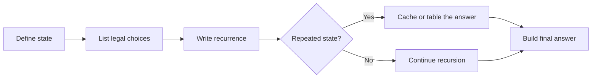

# Dynamic Programming Pattern: A Reasoning-First C++ Guide

Dynamic programming solves repeated subproblems once and reuses their answers.

## Table of Contents
1. [Core Concept & Philosophy](#1-core-concept--philosophy)
2. [The Five-Step Method](#2-the-five-step-method)
3. [The Universal Template (all 3 forms)](#3-the-universal-template-all-3-forms)
4. [Why This Works — Overlapping Subproblems Visualized](#4-why-this-works--overlapping-subproblems-visualized)
5. [The 9 DP Patterns](#5-the-9-dp-patterns)
6. [Pattern 1: 0/1 Knapsack](#6-pattern-1-01-knapsack)
7. [Pattern 2: Unbounded Knapsack](#7-pattern-2-unbounded-knapsack)
8. [Pattern 3: Fibonacci-style DP](#8-pattern-3-fibonacci-style-dp)
9. [Pattern 4: Longest Common Subsequence (LCS)](#9-pattern-4-longest-common-subsequence-lcs)
10. [Pattern 5: Longest Increasing Subsequence (LIS)](#10-pattern-5-longest-increasing-subsequence-lis)
11. [Pattern 6: Kadane's Algorithm](#11-pattern-6-kadanes-algorithm)
12. [Pattern 7: Matrix Chain Multiplication (MCM)](#12-pattern-7-matrix-chain-multiplication-mcm)
13. [Pattern 8 & 9: DP on Grids and DP on Trees](#13-pattern-8--9-dp-on-grids-and-dp-on-trees)
14. [Problem-Solving Framework](#14-problem-solving-framework)
15. [Common Pitfalls](#15-common-pitfalls)
16. [Practice Roadmap](#16-practice-roadmap)

---

## 1. Core Concept & Philosophy

### What Dynamic Programming Really Is

DP is not a separate kind of magic. Start with a recursive definition, identify the state, and store the result for each state so it is calculated only once.

If you can write the brute-force recursive solution using [Recursion_Pattern.md](Recursion_Pattern.md)'s Hypothesis → Induction → Base Case method, most of the reasoning is already done. DP fixes one main problem: recursive code may solve the same subproblem many times.

### The Generalized Form

```
DP applies when BOTH are true:

1. Overlapping Subproblems — the same (state) is recomputed multiple
   times across different branches of the recursion tree.

2. Optimal Substructure — the optimal answer to the big problem can be
   built directly from optimal answers to its sub-problems.
```

### The Three-Way Mental Model

```text
                                 Same state-space tree
                                             |
                     +-----------------+-----------------+
                     |                 |                 |
             Recursion        Backtracking              DP
         follow one rule    explore choices       cache repeated states
         and return upward  do -> recurse -> undo  compute each state once
```

The important question is not "which table do I memorize?" It is: **what information completely describes the remaining problem?** Those changing values are the DP state and become the dimensions of the memo or table.

### DP State Diagram



DP is not a table-first technique. The state and transition come first; memoization and tabulation only avoid solving the same state repeatedly.

---

## 2. The Five-Step Method

Use these five steps for most DP problems:

```
STEP 1            STEP 2              STEP 3             STEP 4            STEP 5
Recursion    →  Identify        →   Memoization     →  Tabulation    →  Space
(brute force)   Overlapping         (Top-Down DP)       (Bottom-Up      Optimization
                Subproblems                              DP)
                                                                        
solve(n)        Draw the tree,     Add a memo/dp[]     Convert          Reduce dp[]
using Hypo →    spot repeated      array; check         recursion to    array to O(1)
Induction →     (state) calls      before compute,      loops, fill     or O(n) using
Base Case       (recursion guide)  store after           dp[] in         only the last
                                    compute              correct order   1-2 rows/values
```

**Why this order matters:** tabulation is the recursive dependency graph written as loops. If the state and recurrence are unclear, a table only hides the mistake. Write the small recursive version first, even when the final code will be iterative.

---

## 3. The Universal Template (all 3 forms)

### Form 1 — Plain Recursion (Step 1)
```cpp
int solve(/* state */) {
    if (isBaseCase(/* state */)) return baseAnswer;

    // try all choices, recurse, combine (min/max/sum/count as needed)
    return combine( solve(smallerState1), solve(smallerState2), ... );
}
```

### Form 2 — Memoization / Top-Down DP (Step 3)
```cpp
int solve(/* state */, vector<...>& memo) {
    if (isBaseCase(/* state */)) return baseAnswer;

    if (memo[state] != -1) return memo[state];       // <-- NEW: check cache

    int ans = combine( solve(smallerState1, memo), solve(smallerState2, memo), ... );

    return memo[state] = ans;                         // <-- NEW: store in cache
}
```

### Form 3 — Tabulation / Bottom-Up DP (Step 4)
```cpp
int solveTabulation(/* size */) {
    vector<...> dp(size, /* base values pre-filled */);

    for (/* iterate state in an order such that smaller states are ready first */) {
        dp[state] = combine( dp[smallerState1], dp[smallerState2], ... );
    }

    return dp[finalState];
}
```

### The Mechanical Recursion → Memoization Conversion
```
1. Identify the changing parameters of solve() → these become dp[] dimensions.
2. Create a dp/memo array sized to cover all possible states, initialized to -1 (or a sentinel).
3. At the TOP of the function: if memo[state] != -1, return memo[state].
4. Right BEFORE every return statement: store the value into memo[state] first.
```
That's it — the recursive logic itself never changes.

---

## 4. Why This Works — Overlapping Subproblems Visualized

Recall the Fibonacci recursion from [Recursion_Pattern.md](Recursion_Pattern.md):

```
WITHOUT MEMO (plain recursion)          WITH MEMO (top-down DP)
        fib(5)                                  fib(5)
       /      \                                /      \
   fib(4)    fib(3)  <- computed AGAIN     fib(4)    fib(3) <- memo[3] hit! (instant)
   /    \    /    \                        /    \
fib(3) fib(2)fib(2)fib(1) <- fib(2) x3!  fib(3) fib(2)
 ...                                       /    \
                                        fib(2) fib(1)  <- memo[2] hit on future calls
Total calls: O(2^n)                    Total calls: O(n) — each state computed ONCE
```

```
   Time Complexity Comparison (n = 40)
   ───────────────────────────────────
   Plain Recursion:   ~1,664,079,733 calls   (visibly hangs)
   Memoized DP:        ~40 calls              (instant)
   Same EXACT logic — only difference is the memo check.
```

This is the same lesson as Binary Search's O(log n) power (README 0): eliminating **redundant** work, not doing "different" work, is where the speedup comes from.

---

## 5. The 9 DP Patterns

Most DP problems fit a small number of recognizable patterns. You usually do not invent a completely new recurrence; you identify which known state and transition shape the problem resembles.

| # | Pattern | Recognize By | Classic Problem |
|---|---------|--------------|------------------|
| 1 | **0/1 Knapsack** | "choice-based": include item or not, EACH item used at most once | Subset Sum, Equal Sum Partition, Target Sum |
| 2 | **Unbounded Knapsack** | items can be reused unlimited times | Rod Cutting, Coin Change (min coins / count ways) |
| 3 | **Fibonacci-style** | `f(n)` depends on a fixed few previous states | Climbing Stairs, House Robber, Min Cost Climbing Stairs |
| 4 | **LCS (Longest Common Subsequence)** | 2 strings/sequences, comparing characters | Edit Distance, Shortest Common Supersequence, Longest Palindromic Subsequence |
| 5 | **LIS (Longest Increasing Subsequence)** | 1 sequence, find optimal subsequence obeying an order | Longest Increasing Subsequence, Russian Doll Envelopes |
| 6 | **Kadane's Algorithm** | contiguous subarray with max/min sum | Maximum Subarray, Maximum Product Subarray |
| 7 | **MCM (Matrix Chain Multiplication)** | "where do I cut/partition this range optimally?" | Palindrome Partitioning, Boolean Parenthesization, Burst Balloons |
| 8 | **DP on Grids** | 2D grid, move right/down (or similar) | Unique Paths, Minimum Path Sum, Cherry Pickup |
| 9 | **DP on Trees** | optimal value depends on children's DP values | House Robber III, Diameter of Binary Tree, Max Path Sum |

**How to use this table:** the moment you read a new problem, ask "which row does this look like?" — that instantly tells you the shape of your `dp[]` array and the recurrence, before you've written a single line of code.

---

## 6. Pattern 1: 0/1 Knapsack

**Signature question:** "Given items with weight & value, and a capacity, choose a SUBSET (each item once) to maximize/satisfy something."

### Recursive Template (Step 1)
```cpp
// solve(idx, capacity) = max value using items[idx..n-1] within `capacity`
int solve(vector<int>& wt, vector<int>& val, int idx, int capacity) {
    if (idx == wt.size() || capacity == 0) return 0;     // BASE CASE

    int notTake = solve(wt, val, idx + 1, capacity);      // exclude item idx

    int take = 0;
    if (wt[idx] <= capacity)                              // valid to include?
        take = val[idx] + solve(wt, val, idx + 1, capacity - wt[idx]);

    return max(take, notTake);
}
```

### Tabulation (Step 4)
```cpp
int knapsack(vector<int>& wt, vector<int>& val, int W) {
    int n = wt.size();
    vector<vector<int>> dp(n + 1, vector<int>(W + 1, 0));

    for (int idx = n - 1; idx >= 0; idx--) {
        for (int cap = 0; cap <= W; cap++) {
            int notTake = dp[idx + 1][cap];
            int take = (wt[idx] <= cap) ? val[idx] + dp[idx + 1][cap - wt[idx]] : 0;
            dp[idx][cap] = max(take, notTake);
        }
    }
    return dp[0][W];
}
```

### Dry Run — `wt=[1,3,4,5], val=[1,4,5,7], W=7`
```
dp table (rows = idx from n down to 0, cols = capacity 0..7)
idx=4(base): all 0
idx=3 (wt=5,val=7): cap<5→0, cap>=5→7
idx=2 (wt=4,val=5): cap<4→(row below), cap>=4→max(5+row3[cap-4], row3[cap])
... builds up until idx=0
Final answer sits at dp[0][7] = 9  (items wt=3,val=4 + wt=4,val=5)
```

**Recognize these as 0/1 Knapsack variants:** Subset Sum (`val[i]=wt[i]`, check if capacity exactly reachable), Equal Sum Partition (Subset Sum with target = totalSum/2), Count of Subsets with Given Sum, Minimum Subset Sum Difference, Target Sum (assign +/- signs).

---

## 7. Pattern 2: Unbounded Knapsack

**Signature question:** "Same as knapsack, but you may reuse an item unlimited times."

**The ONE-line difference from 0/1 Knapsack:**
```cpp
// 0/1 Knapsack:        take = val[idx] + solve(idx + 1, capacity - wt[idx]);
// Unbounded Knapsack:   take = val[idx] + solve(idx,     capacity - wt[idx]);
//                                                 ^^^ stay at idx — item is reusable!
```

```cpp
int solve(vector<int>& wt, vector<int>& val, int idx, int capacity) {
    if (idx == wt.size() || capacity == 0) return 0;

    int notTake = solve(wt, val, idx + 1, capacity);
    int take = (wt[idx] <= capacity)
             ? val[idx] + solve(wt, val, idx, capacity - wt[idx])   // idx, not idx+1
             : 0;

    return max(take, notTake);
}
```

**Recognize these as Unbounded Knapsack variants:** Rod Cutting (piece lengths = "weights"), Coin Change — Minimum Coins (minimize count instead of maximize value), Coin Change — Count Ways (sum instead of max).

```
Coin Change Minimum Coins — condition function flips to MIN instead of MAX:
dp[cap] = min( dp[cap], 1 + dp[cap - coin] )   for every coin <= cap
```

---

## 8. Pattern 3: Fibonacci-style DP

**Signature question:** "`f(n)` depends on a small fixed window of previous states (f(n-1), f(n-2), …)."

### Example: Climbing Stairs (1 or 2 steps at a time)
```cpp
// Recursion: ways(n) = ways(n-1) + ways(n-2)
int ways(int n, vector<int>& memo) {
    if (n <= 1) return 1;                          // BASE CASE
    if (memo[n] != -1) return memo[n];
    return memo[n] = ways(n - 1, memo) + ways(n - 2, memo);
}
```

### Tabulation + Space Optimization (Step 5)
```cpp
int climbStairs(int n) {
    if (n <= 1) return 1;
    int prev2 = 1, prev1 = 1;          // only need last 2 values, not a full array!
    for (int i = 2; i <= n; i++) {
        int curr = prev1 + prev2;
        prev2 = prev1;
        prev1 = curr;
    }
    return prev1;
}
```

This is the clearest illustration of **Step 5 (Space Optimization)**: since `dp[i]` only ever needs `dp[i-1]` and `dp[i-2]`, we don't need an `O(n)` array at all — two variables suffice, dropping space from `O(n)` to `O(1)`.

**Recognize these as Fibonacci-style:** House Robber (`dp[i] = max(dp[i-1], dp[i-2] + nums[i])`), Min Cost Climbing Stairs, Decode Ways.

---

## 9. Pattern 4: Longest Common Subsequence (LCS)

**Signature question:** "Two strings/arrays — compare characters, build a relationship between them."

### Recursive Template
```cpp
// solve(i, j) = LCS length of s1[0..i-1] and s2[0..j-1]
int solve(string& s1, string& s2, int i, int j) {
    if (i == 0 || j == 0) return 0;                     // BASE CASE

    if (s1[i - 1] == s2[j - 1])
        return 1 + solve(s1, s2, i - 1, j - 1);          // characters match → both shrink

    return max(solve(s1, s2, i - 1, j), solve(s1, s2, i, j - 1));  // mismatch → try both
}
```

### Tabulation
```cpp
int lcs(string s1, string s2) {
    int n = s1.size(), m = s2.size();
    vector<vector<int>> dp(n + 1, vector<int>(m + 1, 0));

    for (int i = 1; i <= n; i++)
        for (int j = 1; j <= m; j++)
            dp[i][j] = (s1[i-1] == s2[j-1])
                     ? 1 + dp[i-1][j-1]
                     : max(dp[i-1][j], dp[i][j-1]);

    return dp[n][m];
}
```

**Dry Run — `s1="ABCBDAB"`, `s2="BDCABA"` (partial grid):**
```
        ""  B   D   C   A   B   A
    ""   0  0   0   0   0   0   0
    A    0  0   0   0   1   1   1
    B    0  1   1   1   1   2   2
    C    0  1   1   2   2   2   2
    B    0  1   1   2   2   3   3
    D    0  1   2   2   2   3   3
    A    0  1   2   2   3   3   4
    B    0  1   2   2   3   4   4
                                 ^
                          LCS length = 4  (e.g. "BCBA")
```

**Recognize these as LCS-family:** Edit Distance (insert/delete/replace costs), Longest Common Substring (reset to 0 on mismatch, track a global max), Shortest Common Supersequence, Longest Palindromic Subsequence (LCS of the string with its reverse), Minimum Insertions/Deletions to make a string a palindrome.

---

## 10. Pattern 5: Longest Increasing Subsequence (LIS)

**Signature question:** "One sequence — find the best subsequence that must obey an ORDER (increasing/decreasing)."

### Recursive Template (O(n²) DP version)
```cpp
// dp[i] = length of the longest increasing subsequence ENDING exactly at index i
int lengthOfLIS(vector<int>& nums) {
    int n = nums.size();
    vector<int> dp(n, 1);      // every element alone is a subsequence of length 1

    for (int i = 1; i < n; i++)
        for (int j = 0; j < i; j++)
            if (nums[j] < nums[i])
                dp[i] = max(dp[i], dp[j] + 1);

    return *max_element(dp.begin(), dp.end());
}
```

**Dry Run — `nums = [10,9,2,5,3,7,101,18]`:**
```
index:   0   1   2   3   4   5   6    7
nums:   10   9   2   5   3   7  101  18
dp:      1   1   1   2   2   3    4   4
                              (2,3,7,101 or 2,3,7,18 → length 4)
Answer = max(dp) = 4
```

**Recognize these as LIS-family:** Longest Decreasing Subsequence (flip comparator), Russian Doll Envelopes (sort + LIS), Maximum Sum Increasing Subsequence, Longest Chain of Pairs.

---

## 11. Pattern 6: Kadane's Algorithm

**Signature question:** "Find a maximum/minimum sum **contiguous** subarray (not subsequence — must be unbroken)."

```cpp
int maxSubArray(vector<int>& nums) {
    int currentSum = nums[0], maxSum = nums[0];

    for (int i = 1; i < nums.size(); i++) {
        // either extend the previous subarray, or start fresh at nums[i]
        currentSum = max(nums[i], currentSum + nums[i]);
        maxSum = max(maxSum, currentSum);
    }
    return maxSum;
}
```

**The core insight:** `dp[i] = max(nums[i], dp[i-1] + nums[i])` — "should I keep dragging along the previous run, or is it dragging me down (start over)?" This is Fibonacci-style DP (Pattern 3) in disguise, specialized for the "contiguous subarray" shape.

**Recognize as Kadane's-family:** Maximum Product Subarray (track both running max AND min, because a negative × negative can flip a min into the new max), Maximum Circular Subarray Sum.

---

## 12. Pattern 7: Matrix Chain Multiplication (MCM)

**Signature question:** "Given a range `[i, j]`, where do I make an optimal CUT/PARTITION inside it?" This is the "hardest" of the 9 patterns because the recursion has an extra loop for the cut point `k`.

### Recursive Template
```cpp
// solve(i, j) = min cost to fully "resolve" the range [i, j]
int solve(vector<int>& dims, int i, int j) {
    if (i >= j) return 0;                              // BASE CASE: single matrix, no cost

    int minCost = INT_MAX;
    for (int k = i; k < j; k++) {                       // try every cut point
        int cost = solve(dims, i, k) + solve(dims, k + 1, j)
                 + dims[i - 1] * dims[k] * dims[j];      // cost of multiplying at this cut
        minCost = min(minCost, cost);
    }
    return minCost;
}
```

```
General MCM Recurrence Shape (memorize this shape, not just this problem):

dp[i][j] = MIN or MAX over every k in [i, j-1] of:
              dp[i][k]  +  dp[k+1][j]  +  cost_of_combining(i, k, j)
```

**Recognize these as MCM-family:** Palindrome Partitioning (min cuts so every piece is a palindrome), Boolean Parenthesization (count ways to parenthesize to get `True`), Burst Balloons, Egg Dropping Puzzle, Scramble String.

---

## 13. Pattern 8 & 9: DP on Grids and DP on Trees

### DP on Grids — Signature: "move through a 2D grid (right/down, or similar) optimizing a path"
```cpp
// dp[i][j] = min cost to reach cell (i,j) from (0,0)
int minPathSum(vector<vector<int>>& grid) {
    int n = grid.size(), m = grid[0].size();
    vector<vector<int>> dp(n, vector<int>(m));

    for (int i = 0; i < n; i++)
        for (int j = 0; j < m; j++) {
            if (i == 0 && j == 0) dp[i][j] = grid[i][j];
            else if (i == 0)      dp[i][j] = dp[i][j-1] + grid[i][j];       // only from left
            else if (j == 0)      dp[i][j] = dp[i-1][j] + grid[i][j];       // only from top
            else                  dp[i][j] = grid[i][j] + min(dp[i-1][j], dp[i][j-1]);
        }
    return dp[n-1][m-1];
}
```
**Recognize as Grid DP:** Unique Paths, Minimum Falling Path Sum, Cherry Pickup, Dungeon Game.

### DP on Trees — Signature: "optimal value at a node depends on the DP values of its children"
```cpp
// returns {includingRoot, excludingRoot} max sums — classic House Robber III shape
pair<int,int> solve(TreeNode* root) {
    if (!root) return {0, 0};

    auto left  = solve(root->left);
    auto right = solve(root->right);

    int including = root->val + left.second + right.second;      // can't use robbed children
    int excluding = max(left.first, left.second) + max(right.first, right.second);

    return {including, excluding};
}
```
**Recognize as Tree DP:** House Robber III, Diameter of Binary Tree, Binary Tree Maximum Path Sum, Longest Path with Same Value.

---

## 14. Problem-Solving Framework

**Step 1: Write the plain recursive solution FIRST (no shortcuts)**
```
□ Define `solve(state)` in one sentence (the function contract).
□ Find the Base Case.
□ Write the Induction step trying every valid choice.
```

**Step 2: Match to one of the 9 Patterns (Section 5 table)**
```
□ Choice-based, subset, single-use items?  → 0/1 Knapsack
□ Choice-based, reusable items?             → Unbounded Knapsack
□ Depends on a small fixed window of prior state? → Fibonacci-style
□ Two strings/arrays being compared? → LCS-family
□ One sequence + must respect an order? → LIS-family
□ Contiguous subarray sum? → Kadane's
□ Range [i,j] needing an internal cut? → MCM-family
□ 2D grid traversal? → Grid DP
□ Tree with children's answers feeding the parent? → Tree DP
```

**Step 3: Identify Overlapping Subproblems**
```
□ Which parameters of solve() actually change between calls? Those become
  your dp[] dimensions (this is exactly the "changing parameters" rule
  from Section 3).
```

**Step 4: Memoize (Top-Down)**
```
□ Add a memo table sized to the state space, sentinel-initialized.
□ Check-before-compute, store-before-return.
```

**Step 5: Tabulate (Bottom-Up)**
```
□ Convert recursion to iteration; iterate states in the order that
  guarantees dependencies are already computed (usually smallest → largest).
```

**Step 6: Space-Optimize**
```
□ Do you only ever need the previous 1-2 rows/values? Collapse the array.
```

---

## 15. Common Pitfalls

### Pitfall 1: Jumping Straight to Tabulation Without Writing Recursion First
```
The most common warning here is simple: you'll get the loop bounds and
iteration order wrong far more often if you skip the recursive
"Hypothesis → Induction → Base Case" step.
```

### Pitfall 2: Wrong Memo Table Dimensions
```cpp
// WRONG: memo sized only by one changing parameter when TWO parameters change
vector<int> memo(n, -1);            // but solve(idx, capacity) has 2 states!
// RIGHT:
vector<vector<int>> memo(n, vector<int>(capacity + 1, -1));
```

### Pitfall 3: Iterating dp[] in the Wrong Order (Tabulation)
```
If dp[i] depends on dp[i+1] (as in 0/1 Knapsack idx-based recursion),
you MUST iterate idx from n down to 0 — filling forward gives garbage.
```

### Pitfall 4: Confusing 0/1 Knapsack with Unbounded Knapsack
```cpp
// 0/1 (each item once):     solve(idx + 1, cap - wt[idx])
// Unbounded (item reusable): solve(idx,     cap - wt[idx])
// Mixing these up silently gives wrong answers with no crash — always double check!
```

### Pitfall 5: Off-by-One in LCS/Grid Indexing
```
dp tables for string problems are usually sized (n+1) x (m+1) so that
dp[0][j] and dp[i][0] can represent "empty string" base cases cleanly —
forgetting the +1 causes constant index-shift bugs.
```

### Pitfall 6: Forgetting Kadane's "Reset" Rule
```cpp
// WRONG: always extends, never restarts
currentSum = currentSum + nums[i];

// RIGHT: compare extending vs. restarting
currentSum = max(nums[i], currentSum + nums[i]);
```

### Pitfall 7: Applying Subsequence Logic to a Contiguous Problem (or vice versa)
```
LIS allows skipping elements (subsequence).
Kadane's does NOT allow skipping — it must be an unbroken run (contiguous).
Misidentifying which one a problem wants is a very common misread.
```

---

## 16. Practice Roadmap

Use the Dynamic Programming practice sequence as the source roadmap. Work through the stages in order. For every problem, write the state and recurrence before looking at an editorial.

### How to Use This Checklist

1. Try the problem for 25-40 minutes.
2. Write `state`, `choices`, `transition`, and `base case` in plain English.
3. Code memoization first; convert to tabulation only after the recurrence is correct.
4. Mark `S` when solved independently, `R` when solved after review, and `V` after revisiting it a week later.

### Stage 1: 1D DP and Decision Making

- [ ] Climbing Stairs — [LeetCode](https://leetcode.com/problems/climbing-stairs/)
- [ ] Frog Jump
- [ ] Frog Jump with K Distances
- [ ] House Robber — [LeetCode](https://leetcode.com/problems/house-robber/)
- [ ] House Robber II — [LeetCode](https://leetcode.com/problems/house-robber-ii/)
- [ ] Maximum Sum of Non-Adjacent Elements
- [ ] Ninja's Training

**Reason to study first:** these problems teach state design, "take or skip," and how a small recurrence becomes a table.

### Stage 2: Grid DP

- [ ] Unique Paths — [LeetCode](https://leetcode.com/problems/unique-paths/)
- [ ] Unique Paths II — [LeetCode](https://leetcode.com/problems/unique-paths-ii/)
- [ ] Minimum Path Sum — [LeetCode](https://leetcode.com/problems/minimum-path-sum/)
- [ ] Minimum Path Sum in a Triangle — [LeetCode](https://leetcode.com/problems/triangle/)
- [ ] Minimum / Maximum Falling Path Sum — [LeetCode](https://leetcode.com/problems/minimum-falling-path-sum/)
- [ ] Cherry Pickup II — [LeetCode](https://leetcode.com/problems/cherry-pickup-ii/)

**Reason to study next:** the changing coordinates become DP dimensions, and movement directions determine the iteration order.

### Stage 3: Subsequences and Knapsack

- [ ] Subset Sum Equal to K
- [ ] Partition Equal Subset Sum — [LeetCode](https://leetcode.com/problems/partition-equal-subset-sum/)
- [ ] Minimum Difference in Subset Sums
- [ ] Count Subsets with Sum K
- [ ] Count Partitions with a Given Difference
- [ ] 0/1 Knapsack
- [ ] Target Sum — [LeetCode](https://leetcode.com/problems/target-sum/)
- [ ] Coin Change — [LeetCode](https://leetcode.com/problems/coin-change/)
- [ ] Coin Change II — [LeetCode](https://leetcode.com/problems/coin-change-ii/)
- [ ] Unbounded Knapsack
- [ ] Rod Cutting

**Reason to study here:** all of these ask whether to take an item, skip it, or reuse it. The difference between `idx + 1` and `idx` controls 0/1 versus unbounded choices.

### Stage 4: String DP

- [ ] Longest Common Subsequence — [LeetCode](https://leetcode.com/problems/longest-common-subsequence/)
- [ ] Print the Longest Common Subsequence
- [ ] Longest Common Substring
- [ ] Longest Palindromic Subsequence — [LeetCode](https://leetcode.com/problems/longest-palindromic-subsequence/)
- [ ] Minimum Insertions to Make a String Palindrome — [LeetCode](https://leetcode.com/problems/minimum-insertion-steps-to-make-a-string-palindrome/)
- [ ] Minimum Insertions / Deletions to Convert Strings
- [ ] Shortest Common Supersequence — [LeetCode](https://leetcode.com/problems/shortest-common-supersequence/)
- [ ] Distinct Subsequences — [LeetCode](https://leetcode.com/problems/distinct-subsequences/)
- [ ] Edit Distance — [LeetCode](https://leetcode.com/problems/edit-distance/)
- [ ] Wildcard Matching — [LeetCode](https://leetcode.com/problems/wildcard-matching/)

**Reason to study here:** the state is usually a pair of prefixes. Matching characters gives a diagonal transition; a mismatch creates choices such as delete, insert, or replace.

### Stage 5: Stock DP

- [ ] Best Time to Buy and Sell Stock — [LeetCode](https://leetcode.com/problems/best-time-to-buy-and-sell-stock/)
- [ ] Best Time to Buy and Sell Stock II — [LeetCode](https://leetcode.com/problems/best-time-to-buy-and-sell-stock-ii/)
- [ ] Best Time to Buy and Sell Stock III — [LeetCode](https://leetcode.com/problems/best-time-to-buy-and-sell-stock-iii/)
- [ ] Best Time to Buy and Sell Stock IV — [LeetCode](https://leetcode.com/problems/best-time-to-buy-and-sell-stock-iv/)
- [ ] Best Time to Buy and Sell with Cooldown — [LeetCode](https://leetcode.com/problems/best-time-to-buy-and-sell-stock-with-cooldown/)
- [ ] Best Time to Buy and Sell with Transaction Fee — [LeetCode](https://leetcode.com/problems/best-time-to-buy-and-sell-stock-with-transaction-fee/)

**Reason to study here:** the essential state is usually `(day, canBuy, transactionsLeft)`. Once that state is explicit, every stock variation changes only the transition or an extra restriction.

### Stage 6: LIS and Subsequence Optimization

- [ ] Longest Increasing Subsequence — [LeetCode](https://leetcode.com/problems/longest-increasing-subsequence/)
- [ ] Print the Longest Increasing Subsequence
- [ ] Longest Divisible Subset — [LeetCode](https://leetcode.com/problems/largest-divisible-subset/)
- [ ] Longest String Chain — [LeetCode](https://leetcode.com/problems/longest-string-chain/)
- [ ] Longest Bitonic Subsequence
- [ ] Number of Longest Increasing Subsequences — [LeetCode](https://leetcode.com/problems/number-of-longest-increasing-subsequence/)
- [ ] Russian Doll Envelopes — [LeetCode](https://leetcode.com/problems/russian-doll-envelopes/)

**Reason to study here:** unlike substring problems, a subsequence may skip elements. The previous compatible element, not merely the previous index, controls the transition.

### Stage 7: Partition and Interval DP

- [ ] Matrix Chain Multiplication
- [ ] Minimum Cost to Cut a Stick — [LeetCode](https://leetcode.com/problems/minimum-cost-to-cut-a-stick/)
- [ ] Burst Balloons — [LeetCode](https://leetcode.com/problems/burst-balloons/)
- [ ] Boolean Parenthesization
- [ ] Palindrome Partitioning II — [LeetCode](https://leetcode.com/problems/palindrome-partitioning-ii/)
- [ ] Partition Array for Maximum Sum — [LeetCode](https://leetcode.com/problems/partition-array-for-maximum-sum/)

**Reason to study last:** these problems ask which split or operation happens last. Choosing the last operation often makes the left and right intervals independent.

### Weekly Revision Loop

```text
Day 1: Learn one state pattern and solve 2 problems.
Day 2: Re-solve both without notes; compare recurrences.
Day 4: Solve one variation with a different base case.
Day 7: Re-solve the hardest problem from a blank page.
```

Keep a small error log beside this checklist. Record the exact mistake: wrong state, wrong base case, wrong loop order, wrong take/skip transition, or incorrect space optimization. Reviewing mistakes is more valuable than collecting more problem names.

---

## Key Takeaways

1. **DP is recursion with a cache** — nothing more. If you can't write the recursive solution, you can't write the DP solution.
2. **Follow the 5 steps in order:** Recursion → spot overlapping subproblems → Memoization → Tabulation → Space optimization.
3. **Learn to recognize the 9 patterns**, not 9×∞ individual problems. New problems are almost always a variant of one of these shapes.
4. **The changing parameters of your recursive function ARE your dp[] dimensions** — this single rule prevents most tabulation bugs.
5. **Space optimization is a bonus, not a requirement** — get a correct O(n²)/O(n·m) tabulated solution first, then collapse rows if the recurrence only looks 1-2 states back.

**The three guides fit together:** recursion trusts smaller calls; backtracking adds choices and undo; dynamic programming adds memory for repeated states. The function contract and the state-space tree connect all three topics.

---

## Dynamic Programming Playlist: Ordered Practice

Follow the playlist in this order. The reliable order is **recursive choice -> state -> memoization -> tabulation -> space optimization**.

### 0/1 Knapsack family

1. [0/1 Knapsack](https://www.geeksforgeeks.org/0-1-knapsack-problem-dp-10/)
2. [Subset Sum](https://leetcode.com/problems/partition-equal-subset-sum/)
3. [Equal Sum Partition](https://leetcode.com/problems/partition-equal-subset-sum/)
4. [Count of Subsets with a Given Sum](https://www.geeksforgeeks.org/count-of-subsets-with-sum-equal-to-x/)
5. [Minimum Subset Sum Difference](https://www.geeksforgeeks.org/minimum-sum-partition/)
6. [Target Sum](https://leetcode.com/problems/target-sum/)

### Unbounded and sequence families

7. [Unbounded Knapsack](https://www.geeksforgeeks.org/unbounded-knapsack-repetition-items-allowed/)
8. [Rod Cutting](https://www.geeksforgeeks.org/cutting-a-rod-dp-13/)
9. [Coin Change](https://leetcode.com/problems/coin-change/)
10. [Coin Change II](https://leetcode.com/problems/coin-change-2/)
11. [Longest Common Subsequence](https://leetcode.com/problems/longest-common-subsequence/)
12. [Longest Common Substring](https://www.geeksforgeeks.org/longest-common-substring-dp-29/)
13. [Shortest Common Supersequence](https://leetcode.com/problems/shortest-common-supersequence/)
14. [Edit Distance](https://leetcode.com/problems/edit-distance/)
15. [Longest Palindromic Subsequence](https://leetcode.com/problems/longest-palindromic-subsequence/)

### Advanced families

16. [Matrix Chain Multiplication](https://www.geeksforgeeks.org/matrix-chain-multiplication-dp-8/)
17. [Palindrome Partitioning](https://leetcode.com/problems/palindrome-partitioning-ii/)
18. [Scramble String](https://leetcode.com/problems/scramble-string/)
19. [Egg Dropping](https://www.geeksforgeeks.org/egg-dropping-puzzle-dp-11/)
20. [Longest Increasing Subsequence](https://leetcode.com/problems/longest-increasing-subsequence/)
21. [Best Time to Buy and Sell Stock IV](https://leetcode.com/problems/best-time-to-buy-and-sell-stock-iv/)

### The explanation that prevents memorisation

Define `dp[state]` in one sentence. Every transition must represent all legal choices from that state. For knapsack, the choice is take or skip; for LCS, match or skip; for partition DP, choose the final cut. If two recursive calls reach the same state, cache it. Only after the recurrence is correct should you change table order or remove dimensions.

### Additional practice overlap

Additional practice: [Climbing Stairs](https://leetcode.com/problems/climbing-stairs/), [House Robber](https://leetcode.com/problems/house-robber/), [Ninja's Training](https://www.geeksforgeeks.org/problems/ninjas-training/1), [Maximum Sum of Non-Adjacent Elements](https://www.geeksforgeeks.org/problems/maximum-sum-of-non-adjacent-elements/0), [Distinct Subsequences](https://leetcode.com/problems/distinct-subsequences/), [Burst Balloons](https://leetcode.com/problems/burst-balloons/), and [Minimum Cost to Cut a Stick](https://leetcode.com/problems/minimum-cost-to-cut-a-stick/).
