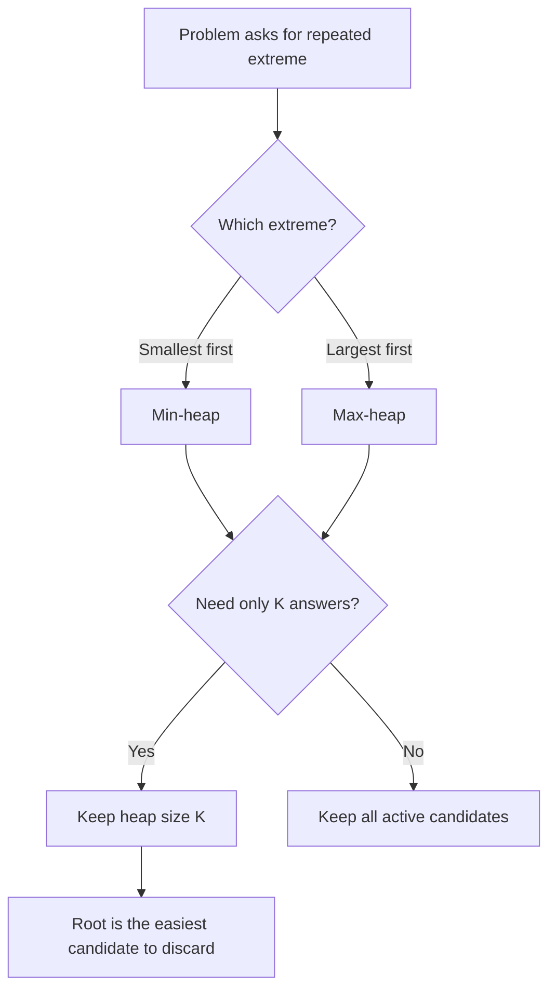
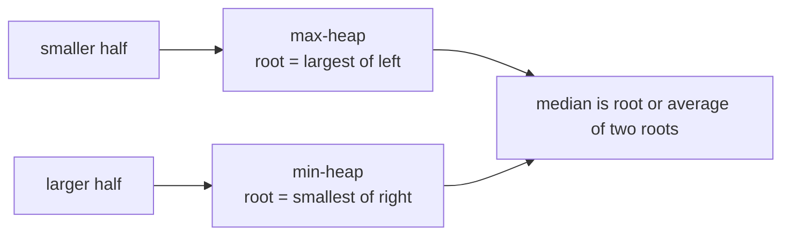
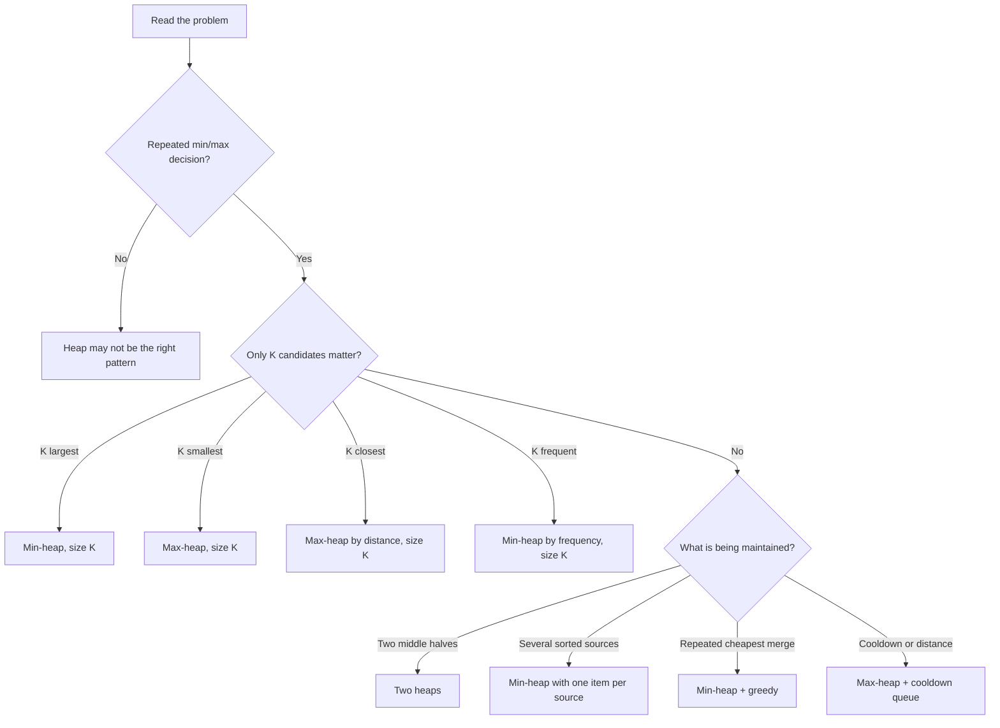

# Heap Pattern: Playlist Notes

> **Goal:** understand why a heap is chosen, instead of memorising 15 unrelated solutions.

This note follows a **Heap / Priority Queue** playlist sequence. Video titles and order can change between playlist versions, so the checklist below uses the problem names rather than video numbers.

## Table of Contents

1. [The One Idea Behind Every Question](#1-the-one-idea-behind-every-question)
2. [Heap Basics](#2-heap-basics)
3. [The Most Important Decision: Min or Max](#3-the-most-important-decision-min-or-max)
4. [Playlist Questions](#4-playlist-questions)
5. [Pattern A: Kth Smallest and Kth Largest](#5-pattern-a-kth-smallest-and-kth-largest)
6. [Pattern B: K-Sorted Array](#6-pattern-b-k-sorted-array)
7. [Pattern C: K Closest / Top K](#7-pattern-c-k-closest--top-k)
8. [Pattern D: Frequency and Greedy Heap](#8-pattern-d-frequency-and-greedy-heap)
9. [Pattern E: Two Heaps and Streaming Median](#9-pattern-e-two-heaps-and-streaming-median)
10. [Pattern F: Merge K Sorted Sequences](#10-pattern-f-merge-k-sorted-sequences)
11. [Recognition Flowchart](#11-recognition-flowchart)
12. [Complexity and Mistakes](#12-complexity-and-mistakes)
13. [One-Page Revision](#13-one-page-revision)

---

## 1. The One Idea Behind Every Question

A heap is useful when the next action depends on the **smallest or largest available item**.

The key question is:

> **What must remain available after each step?**

If we repeatedly need the minimum, use a **min-heap**. If we repeatedly need the maximum, use a **max-heap**.

For a Top K problem, we do not need to keep all `n` items perfectly sorted. We only keep the `k` useful candidates and throw away the candidate that can no longer enter the answer.



### Why not sort every time?

Sorting gives a complete order in `O(n log n)`. A heap gives only the next extreme in `O(log n)` after insertion. When the answer needs only `K` items, a size-`K` heap costs `O(n log K)`, which is better when `K` is much smaller than `n`.

---

## 2. Heap Basics

A binary heap is a **complete binary tree** with a heap property. It is not a sorted array: siblings and distant nodes do not have to be ordered.

```text
MAX-HEAP                         ARRAY STORAGE
       50                         index:  0  1  2  3  4  5
      /  \                         value: [50,30,40,10,20,35]
    30    40
   /  \  /
 10   20 35

Every parent >= its children.
```

For a zero-indexed array:

```text
parent(i) = (i - 1) / 2
left(i)   = 2*i + 1
right(i)  = 2*i + 2
```

| Operation | Meaning | Complexity |
|---|---|---:|
| `top()` | Read min/max | `O(1)` |
| `push(x)` | Insert and move upward | `O(log n)` |
| `pop()` | Remove root and move downward | `O(log n)` |
| `size()` | Number of items | `O(1)` |

### C++ syntax

```cpp
priority_queue<int> maxHeap;
priority_queue<int, vector<int>, greater<int>> minHeap;

maxHeap.push(10);
minHeap.push(10);
int largest = maxHeap.top();
int smallest = minHeap.top();
```

---

## 3. The Most Important Decision: Min or Max

This rule prevents most heap mistakes:

| Required answer | Heap to maintain | Why is its root useful? |
|---|---|---|
| K smallest values | **Max-heap of size K** | Largest among current K is easiest to remove |
| K largest values | **Min-heap of size K** | Smallest among current K is easiest to remove |
| K closest values | **Max-heap of size K** | Farthest among current K is easiest to remove |
| K most frequent values | **Min-heap of size K** | Least frequent among current K is easiest to remove |
| Repeated smallest pair | **Min-heap** | Smallest item must be processed first |
| Running median | **Max-heap + min-heap** | One root from each half gives the middle |

### The surprising rule for Top K

To keep the **K largest**, use a **min-heap**, because the root is the weakest of the current winners. If a new number is larger than that root, remove the root and admit the new number.

```text
Find 3 largest in [7, 2, 9, 4, 10, 1]

min-heap, capacity 3:
7       -> [7]
2       -> [2, 7]
9       -> [2, 7, 9]
4       -> pop 2, add 4  -> [4, 7, 9]
10      -> pop 4, add 10 -> [7, 9, 10]
1       -> discard 1

The root is always the weakest current winner.
```

---

## 4. Playlist Questions

These are the core questions in the heap sequence.

### Foundation and Top K

1. [Heap introduction and implementation](https://www.geeksforgeeks.org/dsa/heap-data-structure/)
2. [Kth smallest element in an array](https://www.geeksforgeeks.org/dsa/kth-smallest-largest-element-in-unsorted-array/)
3. [Kth largest element in an array](https://leetcode.com/problems/kth-largest-element-in-an-array/)
4. [Sort a K-sorted (nearly sorted) array](https://www.geeksforgeeks.org/dsa/nearly-sorted-algorithm/)
5. [K closest numbers to a given number](https://www.geeksforgeeks.org/dsa/find-k-closest-elements-given-value/)
6. [Top K frequent numbers](https://leetcode.com/problems/top-k-frequent-elements/)
7. [Frequency sort](https://leetcode.com/problems/sort-characters-by-frequency/)
8. [K closest points to the origin](https://leetcode.com/problems/k-closest-points-to-origin/)

### Greedy and Streaming

9. [Connect ropes to minimise cost](https://www.geeksforgeeks.org/dsa/connect-n-ropes-minimum-cost/)
10. [Sum of elements between the K1th and K2th smallest elements](https://www.geeksforgeeks.org/dsa/sum-elements-k1th-k2th-smallest-elements/)
11. [Kth largest element in a stream](https://leetcode.com/problems/kth-largest-element-in-a-stream/)
12. [Maximum distinct elements after removing K elements](https://www.geeksforgeeks.org/dsa/maximum-distinct-elements-after-removing-k-elements/)
13. [Reorganise a string so adjacent characters are different](https://leetcode.com/problems/reorganize-string/)
14. [Rearrange a string K distance apart](https://www.geeksforgeeks.org/dsa/rearrange-a-string-k-distance-apart/)
15. [Task scheduler / task scheduling with cooldown](https://leetcode.com/problems/task-scheduler/)

### Closely Related Heap Questions

These are commonly taught with the same ideas and are useful extensions:

16. [Median of a stream / running median](https://leetcode.com/problems/find-median-from-data-stream/)
17. [Sliding window median](https://leetcode.com/problems/sliding-window-median/)
18. [Merge K sorted arrays or linked lists](https://leetcode.com/problems/merge-k-sorted-lists/)
19. [Smallest range covering elements from K sorted lists](https://leetcode.com/problems/smallest-range-covering-elements-from-k-lists/)
20. [K maximum-sum combinations from two arrays](https://www.geeksforgeeks.org/dsa/k-maximum-sum-combinations-two-arrays/)

Do not learn 20 separate tricks. Most reduce to: **choose the root that represents the next decision, then restore the heap invariant after each operation.**

---

## 5. Pattern A: Kth Smallest and Kth Largest

### Kth smallest

Keep a **max-heap of size K**. The root is the largest item inside the current K smallest candidates. When a smaller number arrives, it replaces the root.

```cpp
int kthSmallest(const vector<int>& nums, int k) {
    priority_queue<int> pq;

    for (int value : nums) {
        pq.push(value);
        if (static_cast<int>(pq.size()) > k) pq.pop();
    }
    return pq.top();
}
```

### Kth largest

```cpp
int kthLargest(const vector<int>& nums, int k) {
    priority_queue<int, vector<int>, greater<int>> pq;

    for (int value : nums) {
        pq.push(value);
        if (static_cast<int>(pq.size()) > k) pq.pop();
    }
    return pq.top();
}
```

**Reason:** after processing every value, the heap contains exactly the best K candidates. Its root is the boundary value, so it is the Kth answer.

Time: `O(n log K)`; extra space: `O(K)`.

---

## 6. Pattern B: K-Sorted Array

In a K-sorted array, each value is at most `K` positions away from its final position. Therefore, the next correct smallest value must be among the next `K + 1` values.

```cpp
vector<int> sortKSorted(const vector<int>& nums, int k) {
    priority_queue<int, vector<int>, greater<int>> pq;
    vector<int> answer;

    for (int value : nums) {
        pq.push(value);
        if (static_cast<int>(pq.size()) > k) {
            answer.push_back(pq.top());
            pq.pop();
        }
    }

    while (!pq.empty()) {
        answer.push_back(pq.top());
        pq.pop();
    }
    return answer;
}
```

**Reason:** a min-heap keeps the small window of values that could legally be next. We emit its root only after enough values have entered the window.

Time: `O(n log K)`; extra space: `O(K)`.

---

## 7. Pattern C: K Closest / Top K

For K closest numbers or points, define a distance. Keep a **max-heap of size K** because the farthest current winner must be removed first.

```cpp
vector<vector<int>> kClosest(vector<vector<int>>& points, int k) {
    using Point = pair<int, vector<int>>; // {squared distance, point}
    priority_queue<Point> pq;

    for (const auto& point : points) {
        int distance = point[0] * point[0] + point[1] * point[1];
        pq.push({distance, point});
        if (static_cast<int>(pq.size()) > k) pq.pop();
    }

    vector<vector<int>> answer;
    while (!pq.empty()) {
        answer.push_back(pq.top().second);
        pq.pop();
    }
    return answer;
}
```

The same template works for K closest numbers: use `abs(value - x)` as the key. For ties, define the tie rule explicitly if the problem requires an order.

---

## 8. Pattern D: Frequency and Greedy Heap

### Top K frequent and frequency sort

First count frequencies. Then the heap compares frequencies, not the original values. A min-heap of size K keeps only the K strongest frequencies.

```cpp
vector<int> topKFrequent(const vector<int>& nums, int k) {
    unordered_map<int, int> frequency;
    for (int value : nums) frequency[value]++;

    using Item = pair<int, int>; // {frequency, value}
    priority_queue<Item, vector<Item>, greater<Item>> pq;

    for (const auto& [value, count] : frequency) {
        pq.push({count, value});
        if (static_cast<int>(pq.size()) > k) pq.pop();
    }

    vector<int> answer;
    while (!pq.empty()) {
        answer.push_back(pq.top().second);
        pq.pop();
    }
    return answer;
}
```

### Connect ropes to minimise cost

Always join the two shortest ropes. Any rope joined early is paid for again in later joins, so making an unnecessarily large early join increases every future cost.

```cpp
int minCostToConnectRopes(const vector<int>& ropes) {
    priority_queue<int, vector<int>, greater<int>> pq;
    for (int rope : ropes) pq.push(rope);

    int cost = 0;
    while (pq.size() > 1) {
        int first = pq.top(); pq.pop();
        int second = pq.top(); pq.pop();
        int joined = first + second;
        cost += joined;
        pq.push(joined);
    }
    return cost;
}
```

**Reason:** this is the same greedy principle as Huffman coding: combine the two cheapest active items first.

### Rearrange string / task scheduler

Use a max-heap by remaining frequency. Take the most frequent currently legal character/task. If it has remaining copies, place it in a cooldown queue and return it only after the required distance or cooldown has passed.

```text
max-heap:     most frequent legal item
cooldown:     items temporarily unavailable
answer:       choose -> use once -> cooldown -> reinsert
```

The heap chooses the best next item; the queue enforces the spacing rule. A heap alone cannot enforce cooldown.

---

## 9. Pattern E: Two Heaps and Streaming Median

Split the numbers into two halves:



Maintain these invariants:

1. Every value in the max-heap is `<=` every value in the min-heap.
2. Their sizes differ by at most one.

```cpp
class MedianFinder {
    priority_queue<int> left;
    priority_queue<int, vector<int>, greater<int>> right;

public:
    void addNum(int value) {
        if (left.empty() || value <= left.top()) left.push(value);
        else right.push(value);

        if (left.size() > right.size() + 1) {
            right.push(left.top());
            left.pop();
        } else if (right.size() > left.size()) {
            left.push(right.top());
            right.pop();
        }
    }

    double findMedian() const {
        if (left.size() > right.size()) return left.top();
        return (left.top() + right.top()) / 2.0;
    }
};
```

**Reason:** the max-heap exposes the largest value of the lower half, and the min-heap exposes the smallest value of the upper half. Those are exactly the middle boundary values.

---

## 10. Pattern F: Merge K Sorted Sequences

Put the first item from every sequence into a min-heap. When the smallest item is removed, insert the next item from that same sequence.

```text
list 0: 1 -> 8 -> 12
list 1: 2 -> 5 -> 13       heap initially contains [1, 2, 3]
list 2: 3 -> 7 -> 10

pop 1, insert 8
pop 2, insert 5
pop 3, insert 7
...
```

The heap stores at most one active candidate per sequence, so for `N` total values and `K` sequences the complexity is `O(N log K)`.

This also explains the smallest range covering K lists: keep one value from every list, track the current maximum, and advance the list containing the current minimum.

---

## 11. Recognition Flowchart



Ask yourself:

1. What does one heap item represent?
2. What does the root mean right now?
3. Why is it safe to remove the root?
4. What invariant must be restored after insertion/removal?

If you can answer these four questions, the code is usually mechanical.

---

## 12. Complexity and Mistakes

### Complexity cheat sheet

| Question | Data structure | Time | Space |
|---|---|---:|---:|
| Kth smallest/largest | Size-K heap | `O(n log K)` | `O(K)` |
| K closest / K frequent | Size-K heap | `O(n log K)` | `O(K)` |
| K-sorted array | Min-heap of K+1 | `O(n log K)` | `O(K)` |
| Connect ropes | Min-heap | `O(n log n)` | `O(n)` |
| Median stream | Two heaps | `O(n log n)` total | `O(n)` |
| Merge K sorted lists | Min-heap | `O(N log K)` | `O(K)` |

### Common mistakes

- Using a max-heap for K largest. That removes the strongest item; use a min-heap of size K.
- Forgetting to cap the heap at K.
- Comparing the wrong key in custom pairs: distance, frequency, time, or value.
- Assuming a heap is fully sorted. Only the root is guaranteed to be extreme.
- Forgetting empty input, `k == 0`, `k > n`, duplicates, or integer overflow in squared distances.
- Using a heap without a second structure for cooldown or sliding-window expiry.
- In Dijkstra, processing stale heap entries instead of skipping entries whose distance is no longer current.

---

## 13. One-Page Revision

```text
Need smallest repeatedly?                         MIN-HEAP
Need largest repeatedly?                          MAX-HEAP

K largest?        MIN-HEAP of size K; remove smallest
K smallest?        MAX-HEAP of size K; remove largest
K closest?         MAX-HEAP by distance; remove farthest
K frequent?        MIN-HEAP by frequency; remove least frequent

K-sorted array?    MIN-HEAP of next K+1 candidates
Median stream?     MAX-HEAP(left) + MIN-HEAP(right)
Merge K lists?     MIN-HEAP with one candidate per list
Connect ropes?     Repeatedly join two smallest
Cooldown problem?  MAX-HEAP + cooldown queue
```

### The explanation to say in an interview

> "I need the next smallest/largest active candidate, so I will use a heap. I will define what one heap item represents, maintain the heap invariant after every update, and remove the root only when it is proven to be the weakest candidate or the next required candidate."

That reasoning is the pattern. The syntax is only the implementation.

---

*Study order: understand the min/max decision, solve the 15 core playlist questions, then practise the related extensions.*

### Additional practice overlap

Useful second-pass practice: [Kth Largest Element](https://leetcode.com/problems/kth-largest-element-in-an-array/), [Task Scheduler](https://leetcode.com/problems/task-scheduler/), [Hand of Straights](https://leetcode.com/problems/hand-of-straights/), [Design Twitter](https://leetcode.com/problems/design-twitter/), [Find Median from Data Stream](https://leetcode.com/problems/find-median-from-data-stream/), and [Merge K Sorted Lists](https://leetcode.com/problems/merge-k-sorted-lists/).
