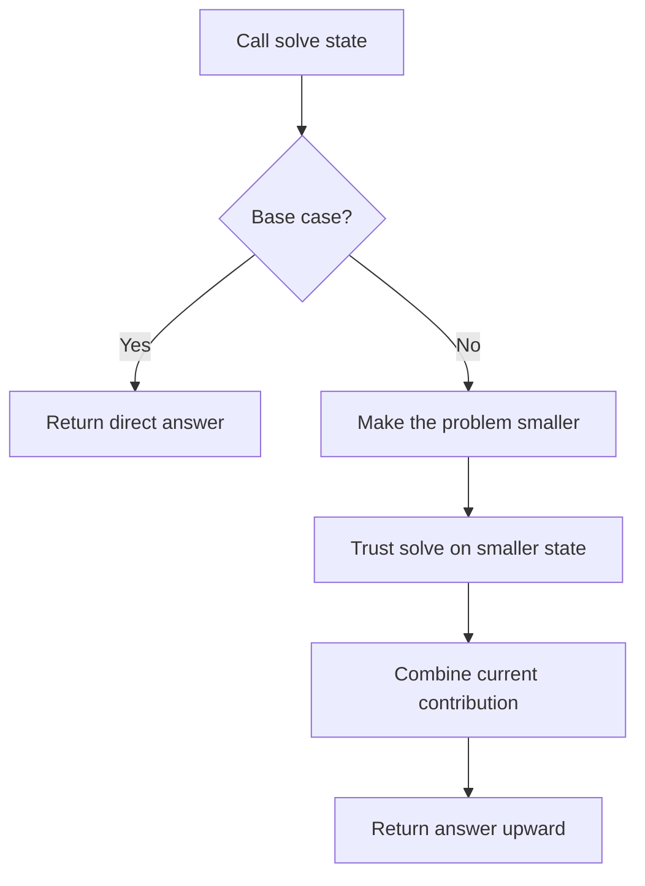

# Recursion Pattern: A Reasoning-First C++ Guide

Recursion solves a problem by defining the answer for a smaller version of the same problem, then using that answer to build the current answer.

## Table of Contents
1. [Core Concept & Philosophy](#1-core-concept--philosophy)
2. [The Method: Hypothesis → Induction → Base Case](#2-the-method-hypothesis--induction--base-case)
3. [The Universal Template](#3-the-universal-template)
4. [Why This Template Works — The Recursion Tree](#4-why-this-template-works--the-recursion-tree)
5. [Mental Model & Pattern Recognition](#5-mental-model--pattern-recognition)
6. [Basic Applications](#6-basic-applications)
7. [Advanced Applications: Pick / Not-Pick Pattern](#7-advanced-applications-pick--not-pick-pattern)
8. [Recursion → Memoization Bridge (preview of DP)](#8-recursion--memoization-bridge-preview-of-dp)
9. [Problem-Solving Framework](#9-problem-solving-framework)
10. [Common Pitfalls](#10-common-pitfalls)
11. [Practice Roadmap](#11-practice-roadmap)

---

## 1. Core Concept & Philosophy

### What Recursion Really Is

Recursion is more than a function calling itself. It is a contract: the function promises to solve a smaller instance, and the current call explains how to use that trusted answer.

The most useful habit is to stop mentally tracing every call. Define what the function returns, trust that definition for the smaller input, and focus only on the current call.

This is the single biggest mindset shift for beginners: **stop trying to trace every call**. Trust the function, exactly like you trust `nums.sort()` without knowing quicksort's internals.

### The Generalized Form

```
solve(n) = combine( n's own contribution, solve(smaller problem) )
```

### Recursion Flow Diagram



The recursive call is a trusted contract. Reason about the current contribution and the route toward the base case.

Just like Binary Search reduces every problem to `condition(mid)`, Recursion reduces every problem to:
- What does `solve(n)` promise to return? (**Hypothesis**)
- How do I get `solve(n)` from `solve(n-1)` (or `solve(n/2)`, or `solve(subset)`)? (**Induction**)
- When do I stop recursing? (**Base Case**)

---

## 2. The Method: Hypothesis → Induction → Base Case

Use this three-step order to design a recursive function. Starting with the contract prevents memorized base cases from replacing actual reasoning:

### Step 1 — Hypothesis (Define the contract)
Decide, in one sentence, what your function is *responsible* for. Nothing about "how" — just "what."

> Example: `factorial(n)` → "returns n! ". `sum(arr, i)` → "returns sum of arr[i..end]."

### Step 2 — Induction (Trust and build)
**Assume** the hypothesis is already true for a smaller sub-problem, and use that trusted result to construct the answer for the current problem. This is the "leap of faith" — do NOT trace into the recursive call.

> `factorial(n) = n * factorial(n-1)` — I don't ask "how does factorial(n-1) work?" I just trust it works and multiply.

### Step 3 — Base Case (Stop the induction)
Find the smallest input where the answer is obvious/trivial, so the induction chain terminates.

> `factorial(0) = 1`

```
      HYPOTHESIS                INDUCTION                 BASE CASE
"what do I return?"   "trust smaller + combine"      "when do I stop?"
        │                        │                          │
        ▼                        ▼                          ▼
  int fact(n) {                                        if (n == 0)
    returns n!         }   return n * fact(n-1);           return 1;
```

### Why This Order Matters
If you start with the base case, you're pattern-matching ("Fibonacci always has `if(n<=1) return n`"). If you start with the **Hypothesis**, you're forced to actually *understand* the problem before writing code — this is exactly the same discipline as designing `condition(mid)` first in Binary Search.

---

## 3. The Universal Template

### C++ Implementation

```cpp
ReturnType solve(Params n) {
    // 1. BASE CASE — smallest input, trivial/known answer
    if (isBaseCase(n)) {
        return trivialAnswer;
    }

    // 2. INDUCTION — trust solve() on a SMALLER input
    ReturnType smallerAnswer = solve(makeSmaller(n));

    // 3. Combine smaller answer with current level's own work
    return combine(n, smallerAnswer);
}
```

### Three Critical Components

**1. Hypothesis (function signature + meaning)**
- What exactly does `solve(n)` return? Write it as a code comment BEFORE writing any code.

**2. Base Case**
- The smallest/simplest input for which you can answer directly, without recursing.
- Rule: must be reachable — every recursive call must eventually shrink toward it.

**3. Induction / Recursive Relation**
- How do you use `solve(smaller)` to build `solve(n)`?
- This is where 90% of problem-solving happens (same as `condition()` in Binary Search).

---

## 4. Why This Template Works — The Recursion Tree

Every recursive call can be drawn as a tree. Understanding this tree is what separates people who "can write recursion" from people who **understand what their code is doing**.

### Example: `fact(4)`

```
fact(4)
 └── 4 * fact(3)
       └── 3 * fact(2)
             └── 2 * fact(1)
                   └── 1 * fact(0)
                         └── return 1        ← BASE CASE hit, tree stops growing
                   └── returns 1*1 = 1
             └── returns 2*1 = 2
       └── returns 3*2 = 6
 └── returns 4*6 = 24
```

Two distinct phases exist in every recursion tree:
- **Going Down (Recursive/Call phase):** parameters shrink, nothing is computed yet, stack frames pile up.
- **Coming Back Up (Return/Combine phase):** base case answer flows back up, each level does its "combine" work.

```
   GOING DOWN                    COMING BACK UP
 (building stack)              (unwinding stack)
 fact(4)  ┐                                    ┐ = 24
   fact(3)│  ┐                            ┐ = 6│
     fact(2)│  ┐                    ┐ = 2 │    │
       fact(1)│  ┐            ┐ = 1 │     │    │
         fact(0)  ──── BASE ────┘   │     │    │
                  = 1                └─────┴────┴─
```

### The Call Stack Connection
Every recursive call pushes a **stack frame** (local variables + return address) onto the call stack. This is *why*:
- Deep recursion can cause **Stack Overflow** (just like an out-of-bounds Binary Search `right` can cause overflow in `mid` calculation — different bug, same "respect your boundaries" lesson).
- Space complexity of a simple linear recursion is **O(depth)**, even if you never declare an array.

---

## 5. Mental Model & Pattern Recognition

### When to Use Recursion?

Ask yourself these questions before writing code:

1. **Can the big problem be expressed in terms of a smaller version of itself?**
   - `n!` in terms of `(n-1)!`? Yes.
   - Sum of array in terms of sum of a smaller array? Yes.

2. **Is there a natural stopping point (base case)?**
   - Empty array, single element, index out of bounds, n == 0.

3. **Do I have a "choice" at every step?**
   - Include this element or not? Go left or right? → This is the doorway into **Backtracking** and **DP** (see the other two READMEs).

### Two Flavors of Recursion

```
HEAD RECURSION                       TAIL RECURSION
(do work AFTER the call)             (do work BEFORE the call)

void f(n) {                          void f(n) {
  if (n==0) return;                    if (n==0) return;
  f(n-1);        <- recurse first      print(n);     <- work first
  print(n);      <- work after         f(n-1);       <- recurse after
}                                     }

f(3) prints: 1 2 3                   f(3) prints: 3 2 1
(smallest to largest)                (largest to smallest)
```

Recognizing head vs tail recursion instantly tells you the **order of output** without tracing — exactly like recognizing `right = mid` vs `left = mid` tells you which half survives in Binary Search.

### Visual Pattern Recognition

```
Pattern 1: Linear Recursion (1 recursive call)
solve(n) -> solve(n-1)
Tree shape:  a straight line, depth = n

Pattern 2: Multiple/Branching Recursion (2+ recursive calls)
solve(n) -> solve(n-1) + solve(n-2)     (Fibonacci)
Tree shape:  branches out exponentially — THIS is why naive
             Fibonacci is O(2^n) and screams "memoize me" (→ DP README)

Pattern 3: Pick / Not-Pick Recursion (subsequence-style)
solve(i) -> solve(i+1) WITH arr[i]
         -> solve(i+1) WITHOUT arr[i]
Tree shape:  binary tree, 2^n leaves = all subsequences
```

---

## 6. Basic Applications

### Example 1: Sum of First N Natural Numbers

#### Question (English)

How can you compute the sum of the first `N` natural numbers using recursion?

#### Intuition (Sochna Kaise Hai?)

#### Example Inputs

```text
n = 5
n = 10
```

Sum `n` ko chhote problem `sum(n-1)` mein tod do. Base case par rukna zaroori hai, warna recursive calls kabhi terminate nahi hongi.

**Hypothesis:** `sum(n)` returns `1 + 2 + ... + n`.

**Base Case:** `sum(0) = 0`.

**Induction:** `sum(n) = n + sum(n-1)`.

```cpp
int sum(int n) {
    if (n == 0) return 0;          // Base Case
    return n + sum(n - 1);         // Induction (trust sum(n-1))
}
```

**Dry Run — `sum(4)`:**
```
sum(4) = 4 + sum(3)
       = 4 + (3 + sum(2))
       = 4 + (3 + (2 + sum(1)))
       = 4 + (3 + (2 + (1 + sum(0))))
       = 4 + (3 + (2 + (1 + 0)))
       = 4 + 3 + 2 + 1 + 0 = 10
```

---

### Example 2: Reverse a String

#### Question (English)

How can you reverse a string recursively?

#### Intuition (Sochna Kaise Hai?)

#### Example Inputs

```text
s = "hello"
s = "recursion"
```

Pehle baaki substring reverse karne do, phir current character ko correct position par place karo. Har call problem size ko chhota karti hai.

**Hypothesis:** `reverse(s, i)` reverses `s[i..end]` in place.

**Base Case:** pointer `i` crosses the midpoint → nothing left to swap.

```cpp
void reverse(string &s, int i, int j) {
    if (i >= j) return;                    // Base Case
    swap(s[i], s[j]);                      // do the work at this level
    reverse(s, i + 1, j - 1);              // Induction on a smaller range
}
```

**Why this is "Tail Recursion":** the work (`swap`) happens BEFORE the recursive call — you can convert this to an iterative `while` loop trivially. Head-recursive problems (like Example 3 below) are the ones where converting to iteration is not obvious.

---

### Example 3: Print 1 to N Without a Loop (Head Recursion Trick)

#### Question (English)

How can you print the numbers from `1` to `N` without using a loop?

#### Intuition (Sochna Kaise Hai?)

#### Example Inputs

```text
n = 5
n = 8
```

Pehle recursive call karke `n-1` tak print karao, phir return ke baad `n` print karo. Ye head-recursion order ascending output deta hai.

```cpp
void printOneToN(int n) {
    if (n == 0) return;             // Base Case
    printOneToN(n - 1);             // Induction FIRST (go all the way down)
    cout << n << " ";               // Work AFTER (comes back up printing in order)
}
```

**Recursion Tree:**
```
printOneToN(3)
 └─ printOneToN(2)
     └─ printOneToN(1)
         └─ printOneToN(0) → BASE, returns immediately
         └─ prints 1
     └─ prints 2
 └─ prints 3

Output order: 1 2 3   (because printing happens on the way UP)
```

Flip it to print `3 2 1` — just move the `cout` line above the recursive call. This small change makes the difference between work done while going down and work done while coming back visible.

---

## 7. Advanced Applications: Pick / Not-Pick Pattern

This is a direct on-ramp into backtracking and dynamic programming. Backtracking adds state changes and undo; dynamic programming remembers repeated subproblem answers.

### The Universal "Pick / Not-Pick" Template

```cpp
void solve(vector<int>& arr, int idx, /* running state */) {
    // Base Case: ran out of elements
    if (idx == arr.size()) {
        // process a complete answer here
        return;
    }

    // CHOICE 1: pick / include arr[idx]
    // ... update state ...
    solve(arr, idx + 1, /* updated state */);
    // ... undo state (needed when this becomes backtracking) ...

    // CHOICE 2: not-pick / exclude arr[idx]
    solve(arr, idx + 1, /* state unchanged */);
}
```

### Example 4: Print All Subsequences of an Array

#### Question (English)

How can you generate every subsequence of an array while preserving element order?

#### Intuition (Sochna Kaise Hai?)

#### Example Inputs

```text
nums = [1, 2, 3]
nums = [4, 5]
```

Har element ko pick ya not-pick karo. Dono branches complete hone par saari possible subsequences cover ho jaati hain.

**Problem:** `arr = [3, 1, 2]` → print all 2³ = 8 subsequences.

```cpp
void subsequences(vector<int>& arr, int idx, vector<int>& current) {
    if (idx == arr.size()) {
        for (int x : current) cout << x << " ";
        cout << (current.empty() ? "{}" : "") << "\n";
        return;
    }

    current.push_back(arr[idx]);       // PICK
    subsequences(arr, idx + 1, current);
    current.pop_back();                // undo the pick

    subsequences(arr, idx + 1, current); // NOT-PICK
}
```

**Recursion Tree for `[3, 1]`:**
```
                         solve(idx=0, [])
                 PICK 3 /                \ NOT-PICK 3
          solve(idx=1,[3])              solve(idx=1,[])
        PICK 1/    \NOT-PICK 1        PICK 1/    \NOT-PICK 1
   solve(2,[3,1]) solve(2,[3])   solve(2,[1])  solve(2,[])
        │              │              │             │
     print[3,1]    print[3]      print[1]       print[]

Total leaves = 2^n = 4 subsequences: {3,1} {3} {1} {}
```

This tree shape — **doubling at every level** — is exactly why brute-force subset/subsequence recursion is **O(2ⁿ)**, and it's the visual proof for why Binary-Search-on-Answer or DP is needed once `n` gets large (30+).

### Example 5: Fibonacci — Where Recursion Alone Breaks Down

#### Question (English)

How can you calculate Fibonacci numbers and avoid repeated recursive work?

#### Intuition (Sochna Kaise Hai?)

#### Example Inputs

```text
n = 6
n = 10
```

Naive recursion same `fib` values baar-baar calculate karti hai. Pehle result ko memoize karo, phir zaroorat ho toh bottom-up DP se space bhi optimize karo.

```cpp
int fib(int n) {
    if (n <= 1) return n;                 // Base Case
    return fib(n - 1) + fib(n - 2);       // Induction — TWO smaller calls
}
```

**Recursion Tree for `fib(5)`:**
```
                         fib(5)
                  /                \
             fib(4)                fib(3)
            /      \               /     \
        fib(3)    fib(2)       fib(2)   fib(1)
        /   \      /   \       /   \
    fib(2) fib(1) fib(1)fib(0)fib(1)fib(0)
     /  \
  fib(1)fib(0)

Notice: fib(3) is computed TWICE, fib(2) is computed THREE times!
```

**This repeated work is called an overlapping subproblem** — it is the signal that this recursion can become dynamic programming by caching results.

---

## 8. Recursion → Memoization Bridge (preview of DP)

Every recursive solution can be sped up the moment you notice:
1. **Overlapping subproblems** (same `(state)` computed multiple times — like `fib(3)` above), AND
2. **Optimal substructure** (the optimal answer to the big problem is built from optimal answers to sub-problems).

```
Plain Recursion            +  Cache/Memo array   =   Memoization (Top-Down DP)
   (exponential)              (store & reuse)         (polynomial time)

int fib(n) {                int fib(n, memo) {
  if (n<=1) return n;         if (n<=1) return n;
  return fib(n-1)             if (memo[n] != -1) return memo[n];   <- NEW
       + fib(n-2);            return memo[n] = fib(n-1,memo)       <- NEW
}                                            + fib(n-2,memo);
                             }
```

This memo check and memo write are the bridge from recursion to dynamic programming. See [DynamicProgramming_Pattern.md](DynamicProgramming_Pattern.md) for the larger patterns.

---

## 9. Problem-Solving Framework

### Step-by-Step Approach

**Step 1: Write the Hypothesis (in English, as a comment)**
```
// solve(i) returns: <exact meaning of what this function computes>
```

**Step 2: Find the Base Case(s)**
```
□ What's the smallest valid input?
□ What happens at an empty array / index out of bounds / n == 0?
□ Are there multiple base cases (e.g., n==0 AND n==1 for Fibonacci)?
```

**Step 3: Write the Induction Step — trust smaller calls blindly**
```
□ Do NOT mentally trace into the recursive call.
□ Ask: "If solve(smaller) already works, how do I build solve(current)?"
```

**Step 4: Decide Head vs Tail (order of side effects)**
```
Work before recursive call  → prints/builds top-down (largest→smallest)
Work after recursive call   → prints/builds bottom-up (smallest→largest)
```

**Step 5: Check for Overlapping Subproblems**
```
□ Draw the recursion tree for a small input (n=4 or 5).
□ Do you see the same (state) appearing in multiple branches?
□ If yes → memoize it (this becomes Dynamic Programming).
```

### Common Patterns Checklist

| Problem Contains | Pattern | Base Case | Induction |
|---|---|---|---|
| "compute f(n) from f(n-1)" | Linear Recursion | n == 0 or 1 | `f(n) = g(n, f(n-1))` |
| "reverse / palindrome check" | Two-Pointer Recursion | `i >= j` | swap/compare, recurse inward |
| "all subsequences / subsets" | Pick/Not-Pick | `idx == n` | include or exclude `arr[idx]` |
| "all permutations" | Swap-based Recursion | `idx == n` | swap each remaining element into position `idx` |
| "tree/graph traversal" | Branching Recursion | `node == null` | recurse on children, combine |
| "same state recomputed" | → use DP | — | add a memo table |

---

## 10. Common Pitfalls

### Pitfall 1: Missing or Unreachable Base Case → Stack Overflow
```cpp
// WRONG: n never reaches the base case if called with a negative number
int fact(int n) {
    if (n == 0) return 1;
    return n * fact(n - 1);   // fact(-1) never stops!
}
```

### Pitfall 2: Tracing Instead of Trusting (breaks the Induction leap of faith)
```
Beginner mistake: mentally simulating the ENTIRE call stack for every problem.
Fix: trust the Hypothesis. If solve(n-1) is correctly defined, just use it.
```

### Pitfall 3: Mutating Shared State Without Undoing (especially in backtracking)
```cpp
// WRONG: current vector keeps growing across branches
current.push_back(arr[idx]);
solve(idx+1, current);
// forgot current.pop_back() here! NOT-PICK branch now has stale data
solve(idx+1, current);
```

### Pitfall 4: Confusing Head vs Tail Recursion Order
```
If output is backwards from what you expect, you likely put your
"work" statement on the wrong side of the recursive call.
```

### Pitfall 5: Not Noticing Overlapping Subproblems (naive exponential recursion)
```
fib(40) with plain recursion ≈ 2^40 calls ≈ will visibly hang.
Same fib(40) with memoization ≈ 40 calls ≈ instant.
Always ask: "am I about to write fib-style branching recursion on a large n?"
```

---

## 11. Practice Roadmap

**Reading / Practice:**
- Recursion practice sheet
- GeeksforGeeks — Recursion tutorial: https://www.geeksforgeeks.org/recursion/
- LeetCode Recursion Explore Card: https://leetcode.com/explore/learn/card/recursion-i/

**Practice Problems (Ordered by Difficulty)**

*Easy:*
- Reverse a String — https://leetcode.com/problems/reverse-string/
- Power of Two (recursive check) — https://leetcode.com/problems/power-of-two/
- Fibonacci Number — https://leetcode.com/problems/fibonacci-number/
- Climbing Stairs — https://leetcode.com/problems/climbing-stairs/

*Medium:*
- Subsets — https://leetcode.com/problems/subsets/
- Permutations — https://leetcode.com/problems/permutations/
- Generate Parentheses — https://leetcode.com/problems/generate-parentheses/
- Letter Combinations of a Phone Number — https://leetcode.com/problems/letter-combinations-of-a-phone-number/
- Pow(x, n) — https://leetcode.com/problems/powx-n/

*Hard:*
- N-Queens (next step: backtracking) — https://leetcode.com/problems/n-queens/
- Sudoku Solver (next step: backtracking) — https://leetcode.com/problems/sudoku-solver/

---

## Key Takeaways

1. **Recursion is induction, not magic.** Trust smaller sub-calls; never mentally unroll the whole tree.
2. **Always fix the order: Hypothesis → Induction → Base Case** — this prevents pattern-matching without understanding.
3. **Draw the recursion tree** for small inputs. It reveals output order (head vs tail) and overlapping subproblems.
4. **The Pick/Not-Pick skeleton is the doorway** to both backtracking and dynamic programming — master it here first.
5. **Overlapping subproblems = your cue to memoize** → that's Dynamic Programming, not a different subject.

**Next:** Continue to [BackTracking_Pattern.md](BackTracking_Pattern.md), which extends Pick/Not-Pick recursion with an "undo" step to explore full solution spaces.

---

## Recursion Playlist: Ordered Practice

Follow the playlist in this order. First learn call-stack movement, then add choices, and only then add memoization or backtracking.

1. [Print 1 to N and N to 1](https://www.geeksforgeeks.org/print-1-to-n-without-using-loops/)
2. [Tower of Hanoi](https://leetcode.com/problems/hanota/)
3. [Sort a Stack Using Recursion](https://www.geeksforgeeks.org/sort-a-stack-using-recursion/)
4. [Delete the Middle Element of a Stack](https://www.geeksforgeeks.org/delete-middle-element-of-a-stack/)
5. [Reverse a Stack Using Recursion](https://www.geeksforgeeks.org/reverse-a-stack-using-recursion/)
6. [Kth Symbol in Grammar](https://leetcode.com/problems/k-th-symbol-in-grammar/)
7. [Josephus Problem](https://www.geeksforgeeks.org/josephus-problem/)
8. [Generate All Subsets](https://leetcode.com/problems/subsets/)
9. [Generate Permutations](https://leetcode.com/problems/permutations/)
10. [Letter Case Permutation](https://leetcode.com/problems/letter-case-permutation/)
11. [Generate Parentheses](https://leetcode.com/problems/generate-parentheses/)
12. [N-bit Binary Numbers with More 1s Than 0s](https://www.geeksforgeeks.org/print-n-bit-binary-numbers-1s-0s-prefixes/)
13. [Unique Subsets](https://leetcode.com/problems/subsets-ii/)

### Why the order matters

For every recursive function, state its meaning, make progress toward the base case, and trust the recursive result for the smaller input. In choice problems, the call stack stores the current path: choose, recurse, undo. That invariant explains subsets, permutations, parentheses, and N-Queens.

### Additional practice overlap

Additional practice: [Subsets](https://leetcode.com/problems/subsets/), [Subsets II](https://leetcode.com/problems/subsets-ii/), [Combination Sum](https://leetcode.com/problems/combination-sum/), [Combination Sum II](https://leetcode.com/problems/combination-sum-ii/), [Palindrome Partitioning](https://leetcode.com/problems/palindrome-partitioning/), [N-Queens](https://leetcode.com/problems/n-queens/), and [Sudoku Solver](https://leetcode.com/problems/sudoku-solver/).
