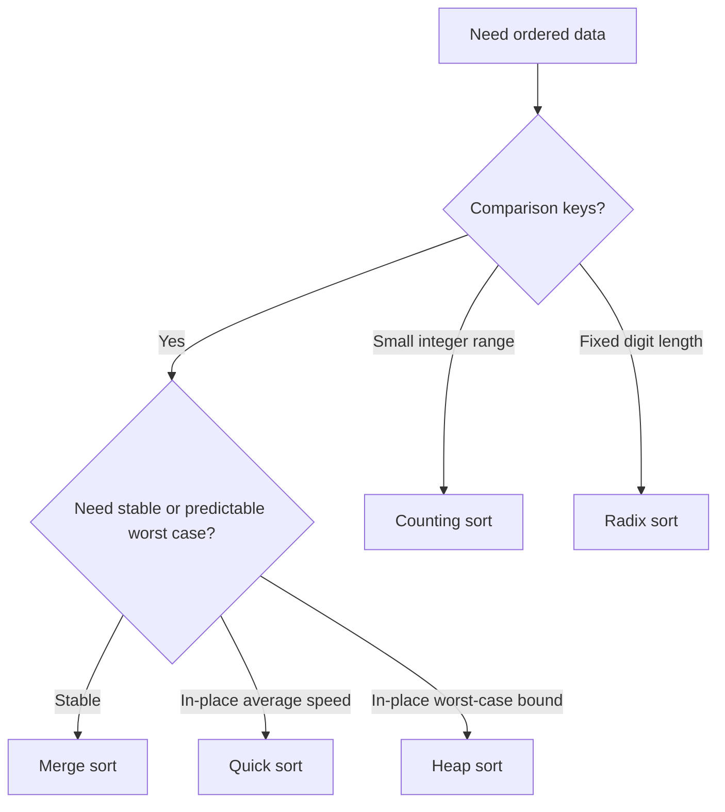

# Ultimate Sorting Pattern Guide - From Basics to Mastery

## Table of Contents

### Part A: Foundation
1. [Core Concept & Philosophy](#1-core-concept--philosophy)
2. [Sorting Algorithm Comparison](#2-sorting-algorithm-comparison)
3. [When to Use Which Sort](#3-when-to-use-which-sort)

### Part B: Comparison-Based Sorts
4. [Pattern 1: Merge Sort (Divide & Conquer)](#4-pattern-1-merge-sort-divide--conquer)
5. [Pattern 2: Quick Sort (Partition)](#5-pattern-2-quick-sort-partition)
6. [Pattern 3: Heap Sort](#6-pattern-3-heap-sort)

### Part C: Non-Comparison Sorts
7. [Pattern 4: Counting Sort](#7-pattern-4-counting-sort)
8. [Pattern 5: Bucket Sort](#8-pattern-5-bucket-sort)
9. [Pattern 6: Radix Sort](#9-pattern-6-radix-sort)

### Part D: Sorting in Problem Solving
10. [Pattern 7: Custom Comparator Sorting](#10-pattern-7-custom-comparator-sorting)
11. [Pattern 8: Sorting Intervals & Events](#11-pattern-8-sorting-intervals--events)
12. [Pattern 9: Sorting by Frequency / Index](#12-pattern-9-sorting-by-frequency--index)

### Part E: Problem Solving
13. [Problem Recognition Framework](#13-problem-recognition-framework)
14. [Practice Problems](#14-practice-problems)
15. [Common Pitfalls](#15-common-pitfalls)
16. [Template Summary](#16-template-summary)

### Sorting Decision Diagram



Choose the sort from the constraints, not from the algorithm name. Stability, memory, key range, and worst-case time decide the branch.

---

## 1. Core Concept & Philosophy

### What is Sorting Really About?

**Wrong Understanding:**
"Sorting means putting numbers in ascending order"

**Correct Understanding:**
"Sorting is the process of **arranging elements in a defined order** to enable **binary search, two pointers, greedy choices, and efficient lookups** — often the KEY preprocessing step that transforms O(n²) into O(n log n) or O(n)"

### Why Sorting Matters in Interviews

```
Unsorted Problem → Sort First → Apply Pattern

Examples:
- Two Sum (sorted) → Two Pointers
- Merge Intervals → Sort by start
- Meeting Rooms → Sort by start time
- Largest Number → Custom sort
- Kth Largest → Quick Select or Sort
```

### Stability

```
STABLE SORT: Equal elements maintain relative order
  Merge Sort ✓   Counting Sort ✓   Insertion Sort ✓
  Quick Sort ✗   Heap Sort ✗

When stability matters:
- Sort by age, then by name (preserve name order for same age)
- Sort tasks by priority, preserve submission order for ties
```

---

## 2. Sorting Algorithm Comparison

| Algorithm | Best | Average | Worst | Space | Stable |
|-----------|------|---------|-------|-------|--------|
| Bubble Sort | O(n) | O(n²) | O(n²) | O(1) | Yes |
| Insertion Sort | O(n) | O(n²) | O(n²) | O(1) | Yes |
| Selection Sort | O(n²) | O(n²) | O(n²) | O(1) | No |
| Merge Sort | O(n log n) | O(n log n) | O(n log n) | O(n) | Yes |
| Quick Sort | O(n log n) | O(n log n) | O(n²) | O(log n) | No |
| Heap Sort | O(n log n) | O(n log n) | O(n log n) | O(1) | No |
| Counting Sort | O(n+k) | O(n+k) | O(n+k) | O(k) | Yes |
| Radix Sort | O(d*(n+k)) | O(d*(n+k)) | O(d*(n+k)) | O(n+k) | Yes |

---

## 3. When to Use Which Sort

```
DECISION TREE:

Need guaranteed O(n log n) worst case?
  └─ Merge Sort or Heap Sort

Need in-place O(n log n)?
  └─ Quick Sort (randomized) or Heap Sort

Small range integers (0 to k)?
  └─ Counting Sort — O(n + k)

Floating point in [0, 1)?
  └─ Bucket Sort

Fixed-width integers (d digits)?
  └─ Radix Sort

Need stability?
  └─ Merge Sort or Counting Sort

Nearly sorted data?
  └─ Insertion Sort — O(n)

In interview, just use:
  sort(arr.begin(), arr.end())  // O(n log n), introsort
```

---

## 4. Pattern 1: Merge Sort (Divide & Conquer)

#### Question (English)

How can you sort an array in `O(n log n)` time using divide and conquer, and count inversions while merging?

#### Intuition (Sochna Kaise Hai?)

#### Example Inputs

```text
nums = [5, 2, 3, 1]
nums = [2, 4, 1, 3, 5]
```

Array ko halves mein todte raho jab tak single elements na bach jaayen. Merge ke time do sorted halves ko combine karo; isi waqt cross inversions bhi count ho sakti hain.

### Concept

```
Split array in half recursively until size 1,
then merge sorted halves.

[38, 27, 43, 3, 9, 82, 10]
       ↓ split
[38,27,43,3]  [9,82,10]
   ↓ split       ↓ split
[38,27][43,3]  [9,82][10]
 ↓merge  ↓merge  ↓merge ↓merge
[27,38][3,43]  [9,82][10]
    ↓merge         ↓merge
  [3,27,38,43]    [9,10,82]
         ↓ merge
    [3, 9, 10, 27, 38, 43, 82]
```

### Implementation

```cpp
void merge(vector<int>& arr, int lo, int mid, int hi, vector<int>& temp) {
    int i = lo, j = mid + 1, k = lo;

    while (i <= mid && j <= hi) {
        if (arr[i] <= arr[j]) temp[k++] = arr[i++];
        else temp[k++] = arr[j++];
    }
    while (i <= mid) temp[k++] = arr[i++];
    while (j <= hi) temp[k++] = arr[j++];

    for (int x = lo; x <= hi; x++) arr[x] = temp[x];
}

void mergeSort(vector<int>& arr, int lo, int hi, vector<int>& temp) {
    if (lo >= hi) return;
    int mid = lo + (hi - lo) / 2;
    mergeSort(arr, lo, mid, temp);
    mergeSort(arr, mid + 1, hi, temp);
    merge(arr, lo, mid, hi, temp);
}
```

### Count Inversions (Merge Sort Application)

```cpp
long long mergeAndCount(vector<int>& arr, int lo, int mid, int hi, vector<int>& temp) {
    long long inversions = 0;
    int i = lo, j = mid + 1, k = lo;

    while (i <= mid && j <= hi) {
        if (arr[i] <= arr[j]) temp[k++] = arr[i++];
        else {
            temp[k++] = arr[j++];
            inversions += (mid - i + 1);  // All remaining in left half
        }
    }
    while (i <= mid) temp[k++] = arr[i++];
    while (j <= hi) temp[k++] = arr[j++];
    for (int x = lo; x <= hi; x++) arr[x] = temp[x];
    return inversions;
}
```

---

## 5. Pattern 2: Quick Sort (Partition)

#### Question (English)

How can you sort or select elements by partitioning an array around a pivot?

#### Intuition (Sochna Kaise Hai?)

#### Example Inputs

```text
nums = [10, 7, 8, 9, 1, 5]
nums = [3, 2, 1, 5, 6, 4], k = 2
```

Pivot ke chhote elements left aur bade elements right side mein arrange karo. Partition ke baad pivot apni final position par hota hai, isliye dono sides independently solve ho sakti hain.

### Concept

```
Pick pivot, partition so left ≤ pivot ≤ right,
recursively sort both sides.

[3, 6, 8, 10, 1, 2, 1]  pivot=1
After partition: [1, 1, 2, 3, 6, 8, 10]
                  ↑ pivot in final position
```

### Lomuto Partition

```cpp
int partition(vector<int>& arr, int lo, int hi) {
    int pivot = arr[hi];
    int i = lo;

    for (int j = lo; j < hi; j++) {
        if (arr[j] <= pivot) {
            swap(arr[i], arr[j]);
            i++;
        }
    }
    swap(arr[i], arr[hi]);
    return i;
}

void quickSort(vector<int>& arr, int lo, int hi) {
    if (lo >= hi) return;
    int p = partition(arr, lo, hi);
    quickSort(arr, lo, p - 1);
    quickSort(arr, p + 1, hi);
}
```

### Quick Select — Kth Smallest in O(n) average

```cpp
int quickSelect(vector<int>& arr, int lo, int hi, int k) {
    if (lo >= hi) return arr[lo];

    int p = partition(arr, lo, hi);

    if (p == k) return arr[p];
    else if (p < k) return quickSelect(arr, p + 1, hi, k);
    else return quickSelect(arr, lo, p - 1, k);
}
```

---

## 6. Pattern 3: Heap Sort

#### Question (English)

How can you sort an array in-place using a heap?

#### Intuition (Sochna Kaise Hai?)

#### Example Inputs

```text
nums = [4, 10, 3, 5, 1]
nums = [12, 11, 13, 5, 6, 7]
```

Max-heap ka root largest element hota hai. Root ko end par swap karke heap size reduce karo aur heapify se invariant restore karo.

```cpp
void heapifyDown(vector<int>& arr, int i, int n) {
    int largest = i;
    int left = 2 * i + 1, right = 2 * i + 2;

    if (left < n && arr[left] > arr[largest]) largest = left;
    if (right < n && arr[right] > arr[largest]) largest = right;

    if (largest != i) {
        swap(arr[i], arr[largest]);
        heapifyDown(arr, largest, n);
    }
}

void heapSort(vector<int>& arr) {
    int n = arr.size();
    for (int i = n / 2 - 1; i >= 0; i--) heapifyDown(arr, i, n);
    for (int i = n - 1; i > 0; i--) {
        swap(arr[0], arr[i]);
        heapifyDown(arr, 0, i);
    }
}
```

---

## 7. Pattern 4: Counting Sort

#### Question (English)

When can you sort integer values in linear time by counting occurrences instead of comparing elements?

#### Intuition (Sochna Kaise Hai?)

#### Example Inputs

```text
nums = [4, 2, 2, 8, 3, 3, 1]
colors = [2, 0, 2, 1, 1, 0]
```

Value range chhoti ho toh har value ki frequency count karo. Counts ko expand karke sorted output milta hai bina pairwise comparisons ke.

### When to Use

```
Range of values is SMALL (0 to k) compared to n
Example: ages 0-120, scores 0-100, characters a-z
```

```cpp
void countingSort(vector<int>& arr, int k) {
    vector<int> count(k + 1, 0);

    for (int num : arr) count[num]++;
    for (int i = 1; i <= k; i++) count[i] += count[i - 1];

    vector<int> output(arr.size());
    for (int i = arr.size() - 1; i >= 0; i--) {
        output[count[arr[i]] - 1] = arr[i];
        count[arr[i]]--;
    }
    arr = output;
}
```

### Application: Sort Colors (Dutch National Flag)

```cpp
void sortColors(vector<int>& nums) {
    int lo = 0, mid = 0, hi = nums.size() - 1;

    while (mid <= hi) {
        if (nums[mid] == 0) swap(nums[lo++], nums[mid++]);
        else if (nums[mid] == 1) mid++;
        else swap(nums[mid], nums[hi--]);
    }
}
// O(n) time, O(1) space — counting sort for 3 values
```

---

## 8. Pattern 5: Bucket Sort

#### Question (English)

How can you distribute values into buckets and sort the buckets to improve performance on suitable input distributions?

#### Intuition (Sochna Kaise Hai?)

#### Example Inputs

```text
nums = [0.42, 0.32, 0.33, 0.52, 0.37, 0.47, 0.51]
nums = [0.78, 0.17, 0.39, 0.26, 0.72, 0.94, 0.21]
```

Values ko range ke hisaab se buckets mein baanto. Har bucket locally sort karo aur buckets ko order mein concatenate karo.

```cpp
void bucketSort(vector<float>& arr) {
    int n = arr.size();
    vector<vector<float>> buckets(n);

    for (float num : arr) {
        int idx = num * n;
        buckets[idx].push_back(num);
    }

    for (auto& bucket : buckets) {
        sort(bucket.begin(), bucket.end());
    }

    int idx = 0;
    for (auto& bucket : buckets) {
        for (float num : bucket) arr[idx++] = num;
    }
}
```

---

## 9. Pattern 6: Radix Sort

#### Question (English)

How can you sort integers by processing their digits from least significant to most significant?

#### Intuition (Sochna Kaise Hai?)

#### Example Inputs

```text
nums = [170, 45, 75, 90, 802, 24, 2, 66]
nums = [329, 457, 657, 839, 436, 720, 355]
```

Har digit position par stable sort karo. Stability purane digit order ko preserve karti hai, isliye next digit process hone par complete ordering build hoti hai.

```cpp
void countingSortByDigit(vector<int>& arr, int exp) {
    int n = arr.size();
    vector<int> output(n), count(10, 0);

    for (int num : arr) count[(num / exp) % 10]++;
    for (int i = 1; i < 10; i++) count[i] += count[i - 1];
    for (int i = n - 1; i >= 0; i--) {
        int digit = (arr[i] / exp) % 10;
        output[count[digit] - 1] = arr[i];
        count[digit]--;
    }
    arr = output;
}

void radixSort(vector<int>& arr) {
    int maxVal = *max_element(arr.begin(), arr.end());
    for (int exp = 1; maxVal / exp > 0; exp *= 10) {
        countingSortByDigit(arr, exp);
    }
}
```

---

## 10. Pattern 7: Custom Comparator Sorting

#### Question (English)

How can you sort objects or strings according to a problem-specific ordering rule?

#### Intuition (Sochna Kaise Hai?)

#### Example Inputs

```text
words = ["3", "30", "34", "5", "9"]
items = [["alice", 3], ["bob", 1], ["carol", 2]]
```

Comparator ko clear pairwise rule dena hota hai. Largest-number type problems mein direct numeric comparison ke bajay `a+b` aur `b+a` compare karo.

### Largest Number

```cpp
string largestNumber(vector<int>& nums) {
    vector<string> strs;
    for (int n : nums) strs.push_back(to_string(n));

    sort(strs.begin(), strs.end(), [](string& a, string& b) {
        return a + b > b + a;  // "30" + "3" = "303" vs "3" + "30" = "330"
    });

    if (strs[0] == "0") return "0";
    string result;
    for (string& s : strs) result += s;
    return result;
}
```

### Sort by Custom Key

```cpp
// Sort people by height descending, name ascending
sort(people.begin(), people.end(), [](vector<int>& a, vector<int>& b) {
    if (a[0] != b[0]) return a[0] > b[0];
    return a[1] < b[1];
});
```

---

## 11. Pattern 8: Sorting Intervals & Events

#### Question (English)

How can you merge intervals, detect overlaps, or process interval events in the correct order?

#### Intuition (Sochna Kaise Hai?)

#### Example Inputs

```text
intervals = [[1, 3], [2, 6], [8, 10], [9, 12]]
intervals = [[1, 4], [4, 5]]
```

Pehle intervals ko start ya end ke according sort karo, phir ek pass mein active boundary maintain karo. Sahi sort key problem ka greedy decision simple bana deti hai.

### Merge Intervals

```cpp
vector<vector<int>> merge(vector<vector<int>>& intervals) {
    sort(intervals.begin(), intervals.end());
    vector<vector<int>> result;

    for (auto& interval : intervals) {
        if (result.empty() || result.back()[1] < interval[0]) {
            result.push_back(interval);
        } else {
            result.back()[1] = max(result.back()[1], interval[1]);
        }
    }
    return result;
}
```

### Non-Overlapping Intervals (Greedy)

```cpp
int eraseOverlapIntervals(vector<vector<int>>& intervals) {
    sort(intervals.begin(), intervals.end(), [](auto& a, auto& b) {
        return a[1] < b[1];  // Sort by END time
    });

    int count = 0, end = INT_MIN;
    for (auto& interval : intervals) {
        if (interval[0] >= end) {
            end = interval[1];
        } else {
            count++;
        }
    }
    return count;
}
```

---

## 12. Pattern 9: Sorting by Frequency / Index

#### Question (English)

How can you reorder values according to frequency, a reference array, or their original index constraints?

#### Intuition (Sochna Kaise Hai?)

#### Example Inputs

```text
nums = [1, 1, 2, 2, 2, 3]
arr1 = [2, 1, 2, 5, 7, 1, 9, 3, 6, 8, 8], arr2 = [2, 1, 8, 3]
```

Required priority ko comparator ya frequency table mein encode karo. Pehle key decide karo, phir tie ke liye exact rule define karke sort karo.

### Sort Array by Increasing Frequency

```cpp
vector<int> frequencySort(vector<int>& nums) {
    unordered_map<int, int> freq;
    for (int n : nums) freq[n]++;

    sort(nums.begin(), nums.end(), [&](int a, int b) {
        if (freq[a] != freq[b]) return freq[a] < freq[b];
        return a > b;  // Higher value first for same frequency
    });
    return nums;
}
```

### Relative Sort Array

```cpp
vector<int> relativeSortArray(vector<int>& arr1, vector<int>& arr2) {
    unordered_map<int, int> pos;
    for (int i = 0; i < arr2.size(); i++) pos[arr2[i]] = i;

    sort(arr1.begin(), arr1.end(), [&](int a, int b) {
        bool inA = pos.count(a), inB = pos.count(b);
        if (inA && inB) return pos[a] < pos[b];
        if (inA) return true;
        if (inB) return false;
        return a < b;
    });
    return arr1;
}
```

---

## 13. Problem Recognition Framework

```
START: Do I need to sort?
│
├─ Finding pairs/triplets with sum condition?
│   └─ YES → Sort + Two Pointers
│
├─ Interval merging/overlap/scheduling?
│   └─ YES → Sort by start (or end for greedy)
│
├─ Kth smallest/largest (one-time)?
│   └─ Quick Select O(n) or partial sort
│
├─ Small integer range (0-k)?
│   └─ Counting Sort O(n+k)
│
├─ Custom ordering (largest number, strings)?
│   └─ Custom comparator sort
│
├─ Need stable sort with equal key groups?
│   └─ Merge Sort or stable sort()
│
└─ Finding duplicates or missing numbers?
    └─ Sort or Counting Sort
```

---

## 14. Practice Problems

### Easy
1. Sort Colors - https://leetcode.com/problems/sort-colors/
2. Merge Sorted Array - https://leetcode.com/problems/merge-sorted-array/
3. Squares of a Sorted Array - https://leetcode.com/problems/squares-of-a-sorted-array/
4. Relative Sort Array - https://leetcode.com/problems/relative-sort-array/
5. Sort Array By Parity - https://leetcode.com/problems/sort-array-by-parity/

### Medium
6. Merge Intervals - https://leetcode.com/problems/merge-intervals/
7. Non-overlapping Intervals - https://leetcode.com/problems/non-overlapping-intervals/
8. Largest Number - https://leetcode.com/problems/largest-number/
9. Kth Largest Element in an Array - https://leetcode.com/problems/kth-largest-element-in-an-array/
10. Sort Characters By Frequency - https://leetcode.com/problems/sort-characters-by-frequency/
11. H-Index - https://leetcode.com/problems/h-index/
12. Meeting Rooms II - https://leetcode.com/problems/meeting-rooms-ii/
13. Insert Interval - https://leetcode.com/problems/insert-interval/
14. Count of Smaller Numbers After Self - https://leetcode.com/problems/count-of-smaller-numbers-after-self/

### Hard
15. Count of Range Sum - https://leetcode.com/problems/count-of-range-sum/
16. Reverse Pairs - https://leetcode.com/problems/reverse-pairs/
17. Maximum Gap - https://leetcode.com/problems/maximum-gap/
18. Minimum Number of Arrows to Burst Balloons - https://leetcode.com/problems/minimum-number-of-arrows-to-burst-balloons/

---

## 15. Common Pitfalls

### Pitfall 1: Integer Overflow in Comparator

```cpp
// WRONG: a - b overflows for large ints
sort(arr.begin(), arr.end(), [](int a, int b) { return a - b < 0; });

// RIGHT
sort(arr.begin(), arr.end(), [](int a, int b) { return a < b; });
```

### Pitfall 2: Wrong Interval Sort Key

```cpp
// For non-overlapping intervals (greedy): sort by END
sort(intervals.begin(), intervals.end(), [](auto& a, auto& b) {
    return a[1] < b[1];
});

// For merging intervals: sort by START
sort(intervals.begin(), intervals.end());
```

### Pitfall 3: Modifying Comparator Data During Sort

```cpp
// WRONG: Comparator depends on data being sorted
// Can cause undefined behavior
```

### Pitfall 4: Using O(n²) Sort When O(n) Possible

```cpp
// For sort colors (3 values): use Dutch National Flag O(n)
// Not: sort(nums.begin(), nums.end()) O(n log n)
```

---

## 16. Template Summary

### Standard Sort
```cpp
sort(arr.begin(), arr.end());
sort(arr.begin(), arr.end(), greater<int>());  // Descending
```

### Custom Comparator
```cpp
sort(arr.begin(), arr.end(), [](auto& a, auto& b) {
    // return true if a should come before b
});
```

### Merge Sort
```cpp
// Divide, merge sorted halves — O(n log n), stable
mergeSort(arr, 0, n-1, temp);
```

### Quick Select
```cpp
// Kth smallest — O(n) average
quickSelect(arr, 0, n-1, k);
```

### Counting Sort
```cpp
// Range 0 to k — O(n + k)
countingSort(arr, k);
```

### Dutch National Flag
```cpp
// 3-value sort — O(n)
int lo=0, mid=0, hi=n-1;
while (mid <= hi) { /* 0,1,2 logic */ }
```

---

## Final Thoughts

**The Power of Sorting:**
- Preprocessing that unlocks two pointers, greedy, and binary search
- Custom comparators solve non-obvious ordering problems
- Linear sorts (counting, radix) beat O(n log n) for special cases
- Quick Select finds Kth element without full sort

**How to Master:**
1. Always ask: "Would sorting make this easier?"
2. Know which sort key to use (start vs end for intervals)
3. Practice custom comparators
4. Remember counting/radix for bounded ranges

---

*Sort first, solve fast — sorting is the hidden superpower of DSA!*
